# Diana HRD Omics

This repository is a validation-first workspace for Diana's future tumor-normal omics data. The goal is to understand whether we can recompute HRD-relevant evidence from raw or near-raw files, while keeping every claim auditable against public known-answer samples before any Diana-specific interpretation is attempted.

The project does four things:

- Builds HRD and TNBC subtype evidence tables from public processed breast-cancer data.
- Runs raw public WES/WGS tumor-normal examples through alignment, calling, and validation paths.
- Tests known-answer samples such as SEQC2/HCC1395, GIAB HG008, and COLO829 so the pipeline returns expected findings.
- Defines the handoff contract for Diana's future FASTQ, BAM, CRAM, VCF, CNV, SV, RNA, and vendor-report files.

## Current State

What is working:

- **HRD evidence tables:** public TCGA/BRCA-style processed data produce reviewer-facing HRR event, allele-state, scar/signature, RNA-context, and failure-mode tables for 28 reference-panel samples.
- **TNBC event subtypes:** Lehmann TNBC subtype context is wired into generated evidence tables, so subtype biology can be discussed beside HRD evidence without treating subtype as a clinical HRD truth label.
- **Raw WES benchmark:** SEQC2/HCC1395 full WES FASTQs run through validation, alignment, duplicate marking, GATK Mutect2, and truth overlap. Current evidence: `1122` exact PASS truth matches, recall `0.8585`, precision `0.9842`.
- **Raw WGS mechanics:** SEQC2/HCC1395 full-source WGS FASTQs exercise BAM validation, Mutect2, coverage-CNV bins, SBS96 mutation context, and SV evidence summaries.
- **Known-answer confirmations:** the expanded 29-target cohort has `19` confirmations, `1` partial confirmation, `3` strict-validation gaps, and `6` request/access blockers. The clearest result is COLO829 BRAF V600E recovery across four public tumor-normal BAM pairs.
- **Diana intake:** the samplesheet template and strict validator are ready. Actual Diana files are still pending.

What is still missing:

- Full Diana raw data, metadata, sample provenance, reference build, and tumor-normal pairing confirmation.
- Full HG008 caller-level recall/precision and SV/CNV reciprocal-overlap benchmarking.
- Full COLO829 SV/CNA benchmarking and tumor-purity sensitivity table.
- True MRD/plasma validation material, likely Seraseq or another request/purchase dataset.
- Reviewer-approved HRD interpretation policy, including CHORD/scarHRD/FACETS/ASCAT/PURPLE-style input requirements and no-call thresholds.

The safe boundary is simple: this repo can produce public-data validation evidence and reviewer packets. It does not make a treatment recommendation or a clinical companion-diagnostic call.

## How It Works

Python owns orchestration and evidence generation. The bioinformatics work is done by familiar tools:

| Layer | Tools |
| --- | --- |
| Workflow and evidence | Python package in `src/diana_omics`, CSV/JSON manifests, generated Markdown reports |
| Alignment and BAM/VCF work | BWA, samtools, bcftools |
| Somatic calling | Java plus GATK MarkDuplicates, Mutect2, FilterMutectCalls, contamination helpers |
| Portable execution | Nextflow, Docker, AWS Batch, S3 |
| Development checks | Ruff, mypy, pytest |
| Optional native scale-up | pysam, pyfaidx, polars, truvari, SigProfiler-compatible signature assignment |

```mermaid
gantt
    title HRD Evidence Computation Path
    dateFormat HH:mm
    axisFormat %H:%M

    section Inputs
    Manifest and metadata load               :inputs_meta, 00:00, 5m
    Omics input validation                   :inputs_validate, 00:05, 5m

    section DNA Processing
    Tumor normal read alignment              :dna_align, 00:10, 30m
    Somatic SNV and indel calling            :dna_call, 00:40, 20m
    VCF normalization and scoring            :dna_score, 01:00, 10m

    section HRD Evidence
    HRR and allele state tables              :hrd_events, 01:10, 10m
    CNV SV SBS96 signature surfaces          :hrd_surfaces, 01:10, 20m
    TNBC subtype and RNA context             :rna_context, 01:20, 10m

    section Validation
    Known answer comparison                  :known_answers, 01:30, 20m
    Verifier gates and no call boundaries    :verify, 01:50, 10m

    section Output
    Reviewer packet and readiness summaries  :outputs, 02:00, 5m
```



Commands all use the same entry point:

```sh
PYTHONPATH=src /usr/bin/python3 -m diana_omics verify:outputs
```

A few representative commands show the shape of the project:

```sh
PYTHONPATH=src /usr/bin/python3 -m diana_omics analyze:hrd
PYTHONPATH=src /usr/bin/python3 -m diana_omics analyze:lehmann
PYTHONPATH=src /usr/bin/python3 -m diana_omics benchmark:full-wes
PYTHONPATH=src /usr/bin/python3 -m diana_omics validate:phase3-wgs
PYTHONPATH=src /usr/bin/python3 -m diana_omics run:known-answer-expanded-cohort
PYTHONPATH=src /usr/bin/python3 -m diana_omics build:diana-template
```

Most readers do not need to run the project. For run instructions, see [docs/operations/running-the-pipeline.md](docs/operations/running-the-pipeline.md).

## Documentation

Start here:

- [docs/README.md](docs/README.md): short documentation map.
- [docs/terms.md](docs/terms.md): command, evidence, and domain vocabulary.
- [docs/status/current-state.md](docs/status/current-state.md): what has passed, what is partial, what is blocked.
- [docs/validation/known-answer-datasets.md](docs/validation/known-answer-datasets.md): public validation samples and dataset priorities.
- [docs/operations/analytics-sequence.md](docs/operations/analytics-sequence.md): systems architecture for analytics orchestration and OSS tool calls.
- [docs/data/source-map.md](docs/data/source-map.md): provenance for datasets, tools, truth sets, and vendor context.
- [docs/operations/running-the-pipeline.md](docs/operations/running-the-pipeline.md): local, Docker, Nextflow, and AWS commands.
- [docs/operations/diana-public-data-download.md](docs/operations/diana-public-data-download.md): public Diana dataset download and transfer guide.

Directory guides:

- [src/README.md](src/README.md): implementation map and command families.
- [src/diana_omics/README.md](src/diana_omics/README.md): package module map and execution flow.
- [src/diana_omics/commands/README.md](src/diana_omics/commands/README.md): command-family folder map.
- [results/README.md](results/README.md): generated evidence map.
- [scripts/README.md](scripts/README.md): shell utilities.
