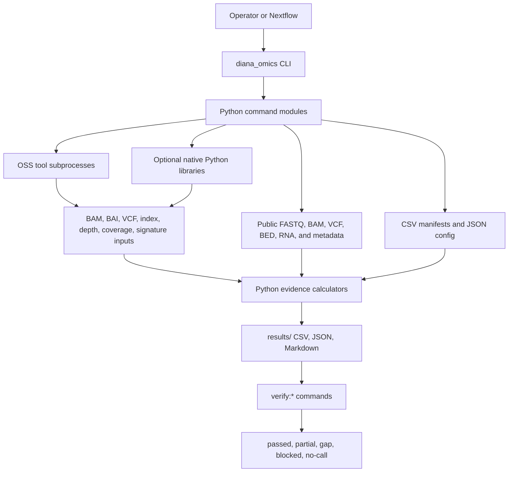
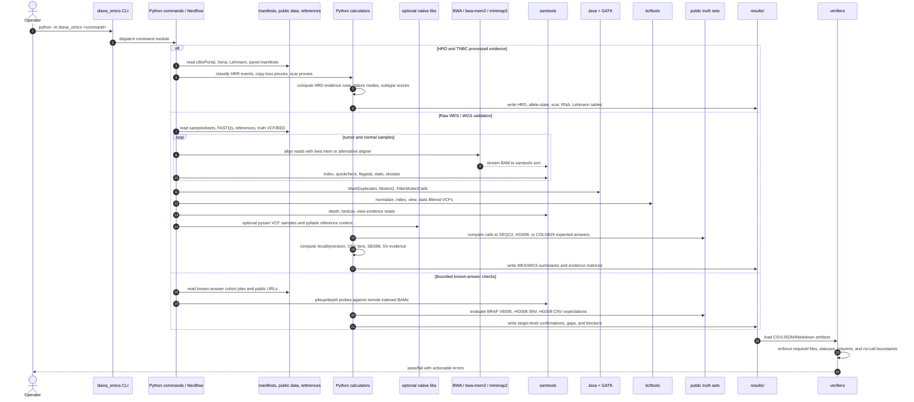

# Analytics System Architecture

This page explains the system boundaries behind the short sequence diagram in the top-level README. Python is the control plane. OSS bioinformatics tools do the heavy data processing. Verifiers make the outputs auditable.

## System Layers

## Runtime Surfaces

| Surface | Role | Main files |
| --- | --- | --- |
| Python CLI | Dispatches every workflow command and verifier. | `src/diana_omics/cli.py`, `src/diana_omics/commands/` |
| Nextflow | Runs the same Python commands locally, in Docker, or in AWS Batch. | `main.nf`, `src/diana_omics/nextflow_process.py` |
| Manifests | Declare samples, references, validation targets, and clinical boundaries. | `manifests/*.csv`, `manifests/*.json` |
| OSS tools | Perform alignment, BAM/VCF processing, somatic calling, and depth scans. | BWA, samtools, bcftools, Java/GATK |
| Optional native libs | Reduce parsing/reference-context risk and prepare for full-depth scale-up. | `pysam`, `pyfaidx`, `polars`, `truvari`, SigProfiler-compatible packages |
| Results | Store generated evidence and reviewer-facing summaries. | `results/` |
| Verifiers | Enforce required files, columns, statuses, and no-call boundaries. | `verify:*` commands |

## Detailed Sequence

## OSS Call Map

| Pipeline step | Python entry point | OSS calls or libraries | Calculation outcome |
| --- | --- | --- | --- |
| Processed HRD evidence | `analyze:hrd` | Python standard library over cBioPortal/GISTIC/Xena data | HRR event table, allele-state proxy, scar proxy, HRD prediction caveats |
| TNBC subtype context | `analyze:lehmann` | Python `urllib`, `zipfile`, `gzip`, XML parsing, cBioPortal API | Lehmann subtype table and signature validation evidence |
| FASTQ to BAM | `benchmark:full-wes`, `validate:phase3-wgs` | BWA or `bwa-mem2`, `samtools sort` | Coordinate-sorted tumor/normal BAMs with read groups |
| BAM QC | `benchmark:full-wes`, `validate:phase3-wgs` | `samtools quickcheck`, `flagstat`, `stats`, `idxstats` | BAM validity, mapped-read counts, duplicate/QC summaries |
| Somatic calling | `benchmark:full-wes`, `validate:phase3-wgs` | Java + GATK `MarkDuplicates`, `Mutect2`, `FilterMutectCalls` | Tumor-normal somatic VCFs and filtered PASS records |
| VCF normalization and scoring | `benchmark:full-wes`, `validate:phase3-wgs` | `bcftools norm`, `index`, `view`, `stats`; optional `pysam` | Truth-overlap keys, recall/precision, sample/header checks |
| CNV evidence | `validate:phase3-wgs` | `samtools bedcov` or `idxstats` | Coverage-derived CNV bins and tumor-normal depth summaries |
| SBS96 evidence | `validate:phase3-wgs` | `bcftools view`; optional `pyfaidx`; fallback `samtools faidx` | SBS96 matrix and signature-assignment-ready mutation context |
| SV evidence | `validate:phase3-wgs` | `samtools view`; future `truvari` for benchmarking | Candidate discordant/supplementary evidence and SV readiness summaries |
| Known-answer probes | `run:known-answer-expanded-cohort` | Remote BAM pileup/depth helpers backed by samtools-style probes | COLO829 BRAF V600E, HG008 SNV/CNV confirmations, gap/blocker report |
| Verification | `verify:*` commands | Python CSV/JSON/Markdown parsing | Machine-checkable pass/fail gates and no-call boundaries |

## Architecture Notes

- Python commands are deterministic adapters around manifests, public inputs, and OSS tool outputs.
- External tools are treated as subprocess dependencies with logs, version capture, and generated summary files.
- Nextflow does not replace Python logic; it provides runtime portability, resource sizing, resume boundaries, Docker, AWS Batch, and S3 publishing.
- The result layer is intentionally redundant: CSV/JSON files are machine-checkable, while Markdown files explain the same evidence for reviewers.
- Clinical interpretation is blocked until verifiers pass, known-answer gaps are closed, and reviewer signoff exists.
