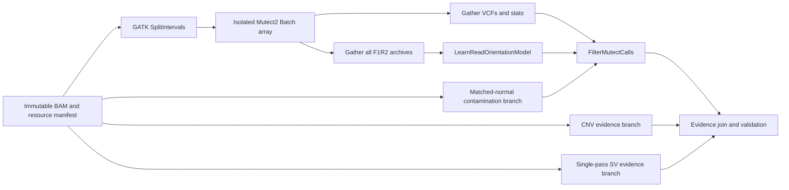

# Historical CPU Fast-Rerun Plan

Status: **superseded historical artifact; do not use as the current deployment plan.**

Recorded: 2026-07-16.

Superseded by: [Next-Generation WGS Fast-Rerun Strategy](../next-generation-fast-rerun.md), which selects one `us-east-2` On-Demand `p5en.48xlarge` Parabricks path under the assumption that GPU quota is approved.

For the current high-level runtime and cost comparison, see [Fast-Rerun Performance and Cost Projection](../fast-rerun-performance-cost-summary.md).

This artifact preserves the CPU strategy considered from the live `diana-wgs-hrd-20260716T033101Z` run before the GPU plan was selected. It is retained for provenance, future incident review, and cases where the reasoning behind rejecting same-host CPU scatter needs to be reconstructed. It is not an active fallback, implementation target, or authorization to submit high-cost compute.

## Historical verdict

**Verdict at the time: promising with gaps.** If GPU quota could not be obtained, the fastest deployable CPU rerun would reuse the validated tumor/normal BAM pair and distribute balanced GATK Mutect2 intervals across isolated AWS Batch jobs. Each caller job would stage its own BAM copies onto its own local disk. The plan explicitly rejected running many Mutect2 JVMs against one shared BAM pair and one shared block device.

The decision chain was:

```text
fastest evidence rerun
  -> existing validated BAM pair
  -> balanced Mutect2 intervals
  -> isolated AWS Batch jobs and local disks
  -> gathered VCF, stats, and F1R2 outputs
  -> contamination, orientation, and FilterMutectCalls
  -> known-answer and no-call validation
  -> research evidence package
```

## Evidence that motivated the CPU design

The live run had this measured critical path at the observation point:

| Stage | Shape | Observed wall time | Finding |
| --- | --- | ---: | --- |
| Preflight | 1 vCPU, 2 GiB | 5 seconds | Not material. |
| Lane alignment | 8 parallel jobs, 16 vCPU and 60 GiB each | 4.00-4.37 hours | Reusable; not part of an evidence-only rerun. |
| Gather and mark duplicates | 64 vCPU, 120 GiB | 2.01 hours | Reusable; normal and tumor had been processed serially. |
| Targeted early look | 32 vCPU, 100 GiB | 26.1 minutes | Demonstrated that bounded evidence could be generated quickly from the completed BAM pair. |
| Full evidence v2 | 64 vCPU, 120 GiB | More than 7 hours 18 minutes and still running | Ten same-host Mutect2 JVMs were the dominant bottleneck. |

The current evidence worker launched ten GATK Mutect2 JVMs through a `ThreadPoolExecutor`. Each process read the same 47.6 GiB tumor BAM and 52.1 GiB normal BAM from one 2 TiB gp3 volume configured for 16,000 IOPS and 1,000 MB/s. Long contigs remained incomplete after roughly 422 minutes. The pattern was consistent with shared random-read, cache, and storage contention, although host CPU and EBS queue-depth metrics were not available to quantify the exact split.

## Historical architecture



### Immutable restart point

The plan began from the completed duplicate-marked BAMs, not FASTQs:

- validate BAM/BAI pairing and `samtools quickcheck`;
- record tumor/normal `SM` tags and roles;
- fingerprint the reference, interval set, PoN, germline resource, and common-sites resource;
- compute SHA-256 for the BAMs because the source objects had multipart ETags but no version ID or SHA-256 checksum;
- store large objects once in a versioned private cache and publish pointer manifests in run result prefixes.

### Isolated CPU scatter

The initial topology was 16 balanced interval shards, with 24 and 32 shards reserved for later benchmarking. `gatk SplitIntervals` would create equal-base standard-contig interval files. Each AWS Batch array child would:

1. Stage the tumor BAM, normal BAM, indices, reference, PoN, and germline resource to its own local volume.
2. Run exactly one GATK 4.6.2.0 Mutect2 process with an explicit CPU, heap, and interval budget.
3. Upload the unfiltered VCF, stats, F1R2 archive, log, timing record, and input digest immediately.
4. Exit independently so Nextflow `-resume` would retry only the failed shard.

For the first speed-first rerun, copying approximately 100 GiB to every caller job was considered acceptable. That traded same-region S3 reads and temporary storage for isolated I/O and lower wall time. Shared FSx for Lustre was deferred until measurement because shared storage could recreate the contention the plan was designed to eliminate.

### Gather and filtering contract

The gather stage had to consume every shard VCF and stats output. Every scatter's F1R2 archive had to be passed to `LearnReadOrientationModel`. The matched-normal contamination table and orientation model then fed the same `FilterMutectCalls` boundary used by the baseline.

Independent QC, contamination, coarse CNV, single-pass SV evidence, SBS96, and packaging processes would checkpoint separately. A late CNV or packet-build failure would not rerun Mutect2.

### Proposed Nextflow boundaries

```text
CPU_FAST_INPUT_MANIFEST
CPU_FAST_SPLIT_INTERVALS
CPU_FAST_MUTECT2
CPU_FAST_GATHER_MUTECT
CPU_FAST_CONTAMINATION
CPU_FAST_ORIENTATION_MODEL
CPU_FAST_FILTER_MUTECT
CPU_FAST_CNV_EVIDENCE
CPU_FAST_SV_EVIDENCE
CPU_FAST_EVIDENCE_JOIN
CPU_FAST_VERIFY_AND_PUBLISH
```

Python would remain the source of truth. Nextflow would own Batch scheduling, fan-out, retries, trace capture, and checkpoint reuse. Large inputs and intermediates would be content-addressed; result directories would contain small evidence artifacts and provenance pointers.

## Historical speed targets

These targets were proposed but never validated:

| Run mode | Acceptance target | Stretch target |
| --- | ---: | ---: |
| Existing BAMs to complete CPU evidence | 2 hours | 90 minutes |
| Resume after one failed caller shard | 30 minutes | 15 minutes |
| CPU topology versus the observed same-host caller | At least 3x faster | At least 5x faster |

## Historical validation gates

### Input identity

- BAM quickcheck and index validation pass.
- Tumor/normal `SM` tags and roles match the manifest.
- BAM, FASTA, intervals, PoN, and germline contigs are compatible.
- Reference and resource hashes match the recorded baseline.
- Existing interpretation and no-call boundaries remain active.

### Topology proof

The smallest evidence unit was the same bounded interval run with one, four, and sixteen isolated jobs. The topology would be accepted only if:

- sixteen-shard wall time was at least 3x faster than the current same-host extrapolation;
- gather, stats, and orientation artifacts were complete;
- no caller shard shared a local BAM path or block device with another caller shard;
- retrying one forced failure did not rerun successful shards;
- normalized VCF output matched the pinned GATK baseline within predeclared thresholds.

### Known-answer boundary

Promotion still required SEQC2/HCC1395 WES truth regression, full-source WGS mechanical checks, and bounded HG008/COLO829 guardrails. A completed CPU run would prove mechanics and research evidence generation, not clinical equivalence or an HRD call.

## Why this plan was not selected

The CPU plan was superseded after the operator chose one plan under the assumption that GPU quota would land. The selected P5en/Parabricks plan has a higher acceleration ceiling and a simpler caller topology. The CPU design also required repeated staging of the full BAM pair, more scatter/gather orchestration, and empirical shard tuning.

The useful lesson remains: if CPU calling is reconsidered, isolate caller jobs and disks. Do not return to ten Mutect2 JVMs sharing one BAM pair and one volume.

## Claims that remain prohibited

- This historical design is not a current deployment recommendation.
- Its speed targets are unmeasured.
- Completion would not authorize clinical reporting.
- Coarse coverage bins are not allele-specific CNV/LOH, scarHRD, CHORD, or HRDetect evidence.
- The single-pass SV scan is not a production structural-variant caller.
- A PASS VCF record is not a pathogenicity classification.
