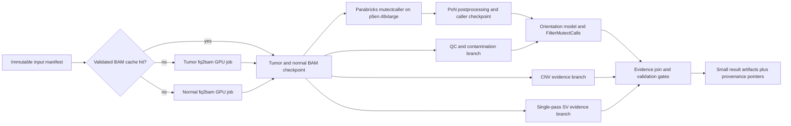

# Next-Generation WGS Fast-Rerun Strategy

Status: selected implementation strategy based on the live `diana-wgs-hrd-20260716T033101Z` run and the operator-stopped v4 retry observed through 2026-07-18 04:49 UTC. This document authorizes no clinical interpretation and does not by itself submit new high-cost compute.

For the executive runtime and cost comparison, see [fast-rerun-performance-cost-summary.md](fast-rerun-performance-cost-summary.md).

## Decision

**Verdict: go, assuming the selected GPU quota lands.** Build one resumable `phase3_wgs_fast` Nextflow workflow in `us-east-2`. Run Parabricks on one On-Demand `p5en.48xlarge` with eight NVIDIA H200 GPUs. Do not build a CPU caller fallback or a multi-region race for the first implementation.

The superseded CPU scatter design is preserved as a historical artifact in [historical/2026-07-16-cpu-fast-rerun-plan.md](historical/2026-07-16-cpu-fast-rerun-plan.md). It is not an active fallback.

The July single-node CPU evidence retry was intentionally stopped during v4
instead of spending further on the monolithic tail. Do not restart that S3-only
worker or race it with an ad hoc GPU recomputation. The next full Diana WGS run
must wait for the requested P5en quota, isolated Batch environment, checked-in
`phase3_wgs_fast` DAG, and bounded Parabricks smoke gate.

For the next run of the current tumor/matched-normal pair, do **not** rerun FASTQ alignment or BAM gathering. Reuse the two validated duplicate-marked BAMs as an immutable input checkpoint and rerun only the evidence DAG. For later FASTQ-origin runs, replace the lane-alignment-plus-gather critical path with parallel Parabricks `fq2bam` jobs only after a separate BAM and known-answer non-inferiority gate passes.

The speed targets are:

| Run mode | Acceptance target | Stretch target |
| --- | ---: | ---: |
| Existing BAMs to complete evidence, warm regional cache | 90 minutes | 60 minutes |
| Existing BAMs to complete evidence, cold regional cache | 2 hours | 90 minutes |
| FASTQs to complete evidence, tumor and normal in parallel | 3 hours | 2 hours |
| Resume after a post-caller branch failure | 30 minutes | 15 minutes |

These are engineering targets, not measured Parabricks performance claims. Promotion requires benchmark evidence.

## What the current run taught us

### Measured critical path

| Stage | Shape | Observed wall time | Finding |
| --- | --- | ---: | --- |
| Preflight | 1 vCPU, 2 GiB | 5 seconds | Not material. |
| Lane alignment | 8 parallel jobs, 16 vCPU and 60 GiB each | 4.00-4.37 hours; 4.37-hour critical path | Parallelism works, but each lane creates a 13-14 GiB intermediate BAM. |
| Gather and mark duplicates | 64 vCPU, 120 GiB | 2.01 hours | Normal and tumor were processed serially. Downloads took about 100 seconds; merge/markdup dominated. |
| Targeted early look | 32 vCPU, 100 GiB, On-Demand | 26.1 minutes | Bounded HRR calls, contamination, QC, and coarse CNV evidence can be produced quickly from the finished BAM pair. |
| Full evidence v2 | 64 vCPU, 120 GiB, Spot | More than 7 hours 47 minutes and still running at observation time | The full CPU Mutect2 scatter is the dominant bottleneck. |
| Full evidence v4 | 64 vCPU, 120 GiB, On-Demand | 25.9 minutes from start to operator stop after previous Mutect2 checkpoints had been restored | The patched worker passed the native-tool UTF-8 crash, completed CNV, reused 23 Mutect2 checkpoints, completed the orientation model, and was stopped during paired contamination pileups before final artifacts were published. |

At the observation point, long-running shards such as `chr1` and `chr2` were still incomplete after roughly 450 minutes of caller progress. The current compute critical path had already exceeded 14.2 hours, excluding queue gaps, and was not complete.

### Root-cause assessment

The primary performance diagnosis is **same-host caller contention**:

- One evidence job launches ten GATK Mutect2 JVMs through a `ThreadPoolExecutor`.
- Every JVM independently reads the same 47.6 GiB tumor BAM and 52.1 GiB normal BAM.
- All processes share one 2 TiB gp3 volume configured for 16,000 IOPS and 1,000 MB/s.
- Each Mutect2 process uses an 8 GiB heap and two PairHMM threads. The 64-vCPU allocation therefore does not remove the shared random-read and cache-pressure bottleneck.
- The current log stream shows highly uneven progress and long-contig stragglers, consistent with contention. This is a high-confidence diagnosis, but the current run did not publish host CPU, page-cache, or EBS queue-depth metrics, so the exact CPU-versus-I/O split remains an evidence gap.

The v4 retry was a useful terminal probe even though it was stopped on purpose:
it proved that the executed worker can restore every per-contig Mutect2
checkpoint from S3 and avoid repeating the expensive caller shards. It also left
`GetPileupSummaries`, contamination, filtering, SBS96, SV evidence, and final
publication inside the same local worker. A failure or operator stop in that
tail still discards those uncheckpointed branches, which is exactly the shape
`phase3_wgs_fast` must remove.

Secondary losses are also material:

- Gather handles normal and tumor serially even though the samples are independent until somatic calling.
- The ad hoc evidence worker performs repeated whole-BAM scans. The version-controlled Phase 3 implementation already has a single-pass SV evidence path and should remain the source of truth.
- The evidence stage is monolithic. A late failure repeats Mutect2, contamination, CNV, SV evidence, and packaging instead of resuming from durable per-branch outputs.
- The work prefix contains 212.1 GiB. The early-look result prefix contains about 113.4 GiB because it copied the approximately 100 GiB BAM pair and reference/resource inputs into the result tree. Results should contain immutable pointers, checksums, and small evidence artifacts, not another copy of every large input.
- The live July run was submitted as a Python worker stored in S3, not as the checked-in Nextflow DAG. The latest local Nextflow session was a successful five-task stub (`61c5a3a4-b2e1-4ecc-9614-d117010fa274`, revision `097f6ee3ff`), so it does not describe the live execution.

## Fastest-rerun architecture



### 1. Immutable input manifest

Every run starts from a manifest, not a mutable directory. The manifest must record:

- pseudonymous run, pair, role, and BAM sample identifiers;
- region-local S3 URI, object size, SHA-256, version ID, and encryption state;
- BAM/BAI pairing and `samtools quickcheck` result;
- reference FASTA and sequence-dictionary fingerprint;
- PoN, germline-resource, common-sites, and interval-set fingerprints;
- container image digest, caller version, parameter digest, and repo commit;
- allowed interpretation level and the required no-call policy.

The current two BAMs are KMS-encrypted but the source bucket returned no version ID or SHA-256 checksum. Their multipart ETags and sizes are recorded, but they are not content hashes. The first rerun preflight should compute SHA-256 once, copy the objects into a versioned immutable cache, and make that cache the restart boundary.

### 2. Content-addressed regional cache

Storage is deliberately traded for speed. Replicate the validated input bundle before compute is needed:

```text
s3://<regional-private-cache>/wgs-v2/
  inputs/<bam-sha256>/tumor.bam
  inputs/<bam-sha256>/tumor.bam.bai
  inputs/<bam-sha256>/normal.bam
  inputs/<bam-sha256>/normal.bam.bai
  references/<reference-sha256>/...
  resources/<resource-sha256>/...
  parabricks/prepon/<pon-sha256>/<image-digest>/...
  outputs/<tool>/<image-digest>/<input-digest>/<parameter-digest>/...
```

Replicate the encrypted bundle from `us-east-1` to a private versioned cache in
`us-east-2`. The `us-east-2` CPU replication process needs only versioned
object reads on the `us-east-1` source buckets, decrypt on the source KMS key,
and write/encrypt permissions on the regional private cache. Use the
region-local destination KMS key and verify checksums after replication. The
result prefix should store the regional object versions and hashes; it should
not recopy BAMs into each run directory.

### 3. Selected GPU environment

The selected environment is `us-east-2` on one On-Demand `p5en.48xlarge`. This shape has 192 vCPUs, 2 TiB of RAM, eight NVIDIA H200 GPUs, and eight 3.8 TB NVMe SSDs. It is explicitly supported through the On-Demand purchase path and is currently offered in all three `us-east-2` availability zones. The current AWS account has zero On-Demand P quota there; this plan assumes that quota is raised before execution.

Quota and capacity contract:

| Need | Request | Purpose |
| --- | ---: | --- |
| Immediate BAM-to-evidence rerun | 192 On-Demand P vCPUs | One `p5en.48xlarge` caller job. |
| Later parallel tumor/normal `fq2bam` | 384 On-Demand P vCPUs | Two `p5en.48xlarge` alignment jobs running concurrently. |

Request the EC2 `Running On-Demand P instances` quota in `us-east-2` at 384
vCPUs. That quota covers both the immediate one-P5en caller job and the later
two-P5en parallel alignment target.

An EC2 offering and approved quota do not guarantee live capacity. The launch step should fail clearly if `p5en.48xlarge` cannot be placed; it should not silently switch instance type, region, caller, or Spot capacity. An operator can retry the same idempotent job without invalidating completed checkpoints.

Use separate managed AWS Batch compute environments and queues:

- `cpu-io-use2`: Graviton families for downloads, QC, packaging, and other ARM-compatible work;
- `gpu-p5en-use2`: x86 ECS GPU-optimized AMI, `p5en.48xlarge` only.

Do not mix GPU and non-GPU jobs in the same queue. GPU job definitions must request GPU resources explicitly. Stripe the eight instance-store NVMe devices into an ephemeral RAID0 `/scratch` volume for Parabricks inputs, temporary data, and outputs; upload every durable checkpoint to S3 before the job exits. Do not run the caller against the container root disk.

### 4. Parabricks caller

Start with `pbrun mutectcaller` against the existing BAM pair. This is the smallest unit that attacks the measured bottleneck without changing alignment or duplicate marking.

Requirements and choices:

- Pin the Parabricks container by immutable digest after confirming the current supported tag.
- Request all eight GPUs and meet NVIDIA's eight-GPU CPU/RAM requirements.
- Use `--run-partition` and record per-GPU utilization so the selected shape can be right-sized only after the first accepted run.
- Build the Parabricks PoN index once with `prepon`, cache it by PoN and image digest, run `mutectcaller`, and apply `postpon` as required for PoN annotation.
- Preserve tumor and normal `SM` names, the exact reference, standard-contig scope, germline resource, interval policy, and downstream contamination/orientation filtering inputs.
- Keep contamination, `LearnReadOrientationModel`, `FilterMutectCalls`, SBS96, CNV, and SV evidence as explicit downstream processes until equivalence is proven. Do not hide the first implementation inside the monolithic `pbrun somatic` wrapper.

Parabricks documents small output differences from GATK caused by math implementations, SIMD behavior, and deterministic hash iteration. Therefore VCF byte equality is not an acceptance criterion; truth performance and variant-level concordance are.

### 5. Independent evidence branches

Run these as separate checkpointed jobs as soon as the BAM manifest passes:

- QC: tumor and normal flagstat/idxstats concurrently, with no redundant full scans.
- Contamination: scatter pileup summaries by balanced intervals, gather, then calculate matched-normal contamination.
- CNV evidence: retain the current coarse coverage result only as partial evidence; do not relabel it as allele-specific CNV, LOH, or scarHRD.
- SV evidence: use the checked-in single-pass BAM scan. This remains mechanical evidence, not a production SV caller.
- Somatic short variants: Parabricks, followed by the same filtering and result boundary.

The final join should be cheap and repeatable. A failed CNV or packet-build branch must not invalidate a completed somatic caller checkpoint.

## Nextflow implementation contract

Add a checked-in `phase3_wgs_fast` workflow rather than another S3-only worker. Suggested process boundaries:

```text
FAST_INPUT_MANIFEST
FAST_REPLICATION_PLAN             immutable copy plan and us-east-2 cache keys
FAST_REPLICATE_INPUTS              source to us-east-2
FAST_CACHE_MANIFEST                verified region-local BAM/resource pointers
FAST_STAGING_PLAN                  exact VersionId to local scratch path map
FAST_PARABRICKS_MUTECT_PLAN        worker-local S3 materialization, SHA-256 verify, exact Parabricks command plan
FAST_BAM_QC_PLAN                   exact quickcheck, flagstat, and idxstats plan
FAST_CNV_EVIDENCE_PLAN             exact full-depth bedcov coverage-bin plan
FAST_FILTER_MUTECT_PLAN            exact contamination/orientation/filter plan
FAST_SV_EVIDENCE_PLAN              exact split/discordant read evidence plan
FAST_GPU_SMOKE                     bounded P5en/Parabricks placement gate
FAST_MUTECT_PARABRICKS_FILTER      worker-local Parabricks, FilterMutect, and small-variant export
FAST_BAM_CNV_SV_EVIDENCE           worker-local BAM QC, coverage-CNV, and split/discordant export
FAST_EVIDENCE_JOIN
FAST_VERIFY_AND_PUBLISH
FAST_CROSSCHECK_MATERIALIZATION_PLAN post-freeze SigProfiler/SBS3 alias materialization plan
FAST_STAGE_DETERMINISTIC_REPORT     six-file deterministic method report
FAST_STAGE_ROSALIND_PACKET          Diana WGS Rosalind reviewer packet
FAST_STAGE_BLOCKED_CROSSCHECKS      FACETS/CHORD/HRDetect blocked no-call packets
```

Implementation rules:

- Python remains the source of truth; Nextflow owns scheduling, per-process containers, retries, and durable checkpoints.
- The workflow has one caller: Parabricks. Do not add a backend-selection flag to the first implementation.
- Map processes to `cpu_io` and `gpu_parabricks` queues.
- Keep the current ARM application image for compatible CPU tasks and use a pinned x86 Parabricks image only for GPU tasks.
- Set the `gpu_parabricks` accelerator request from `phase3_fast_parabricks_num_gpus`; queue placement and a GPU instance type are not enough to reserve or expose H200s to the AWS Batch container.
- Use `-resume` and content digests. Do not use a timestamp alone as a cache key.
- Publish large inputs and intermediates once to the immutable cache. Publish pointer manifests and evidence outputs to the run result prefix.
- Redact sample identifiers from job names and general CloudWatch command logs; retain them only in access-controlled provenance where required.
- Make every process idempotent so a placement failure can be retried without repeating completed work.
- Keep S3 materialization, `staged_inputs_manifest.json` verification, and
  first-caller execution in a single worker-local task so `/scratch` paths never
  cross a Nextflow process boundary without their files.

## Validation and promotion gates

### Gate 0: input and reference identity

Required before any caller benchmark:

- BAM quickcheck and index validation pass.
- Tumor/normal `SM` tags and roles match the manifest.
- BAM, FASTA, interval, PoN, and germline contig names and order are compatible.
- Reference and resource SHA-256 values match between the `us-east-1` source and `us-east-2` cache.
- Existing no-call and interpretation boundaries are loaded into the run manifest.

The checked-in Gate 0 renderer fails closed unless every large BAM, BAI,
reference, and caller-resource object is bound to a SHA-256, non-null S3
VersionId, byte count, encryption state, and the BAM validation receipt that
proved `samtools quickcheck`, BAM/BAI pairing, sample names, and reference
contig compatibility:

```sh
PHASE3_WGS_FAST_PRIVATE_FREEZE_RECEIPT=/path/to/private-freeze.json \
PHASE3_WGS_FAST_PRIVATE_SHA256_RECEIPT=/path/to/private-sha256.json \
PHASE3_WGS_FAST_REFERENCE_FREEZE_RECEIPT=/path/to/reference-freeze.json \
PHASE3_WGS_FAST_REFERENCE_SHA256_RECEIPT=/path/to/reference-sha256.json \
PHASE3_WGS_FAST_BAM_VALIDATION_RECEIPT=/path/to/bam-validation.json \
PHASE3_WGS_FAST_CONTIG_COMPATIBILITY_RECEIPT=/path/to/contig-compatibility.json \
PHASE3_WGS_FAST_CALLER_RESOURCE_RECEIPT=/path/to/caller-resources.json \
PHASE3_WGS_FAST_PARAMETER_SHA256=... \
PHASE3_WGS_FAST_PARABRICKS_CONTAINER=<mirror>@sha256:<digest> \
PHASE3_WGS_FAST_PARABRICKS_CONTAINER_DIGEST=... \
PHASE3_WGS_FAST_PARABRICKS_VERSION=... \
PHASE3_WGS_FAST_SEQUENZA_FEMALE=true \
PYTHONPATH=src /usr/bin/python3 -m diana_omics build:phase3-fast-input-manifest
```

The `phase3_wgs_fast` Nextflow DAG starts with the same renderer as
`FAST_INPUT_MANIFEST`, with each receipt staged as a real process input so
`-resume` is keyed by receipt content rather than by a mutable local directory.
The Gate 0 manifest also requires `method_parameters.sequenza.female` up front,
so the eventual Sequenza/scarHRD route receives an explicit sex-model parameter
from the same immutable input contract as the BAM, BAI, reference, and caller
resources.
Nextflow derives `PHASE3_WGS_FAST_PARABRICKS_CONTAINER_DIGEST` from the pinned
`--parabricks_container`; if a caller still passes both values, the renderer
rejects a digest that does not exactly match the image Batch will run.
It then renders a dry `FAST_REPLICATION_PLAN` with deterministic,
content-addressed source-version to `us-east-2` cache-key rows and the exact
destination KMS key. `FAST_REPLICATE_INPUTS` consumes that plan and defaults to
`dry_run`, writing a replication receipt without S3 calls so review can happen
before the first step that needs write authority in the regional private cache.
The dry-run receipt also fixes the apply strategy: objects at or below the S3
single-copy limit use one `CopyObject`, while larger BAMs are assigned
deterministic `UploadPartCopy` part counts and byte ranges from
`phase3_fast_replication_part_size_bytes`. Apply mode reuses the same encoded
CopySource strings so every copy and multipart part reads the exact source
`VersionId` that SHA-256 validation reviewed, then verifies the destination
size, VersionId, SHA-256 metadata, and KMS key with `HeadObject`.
After an applied copy, `FAST_CACHE_MANIFEST` fails closed unless all 15
content-addressed cache objects were copied or already present with durable
destination `VersionId`s and expected destination checks. Its output is a small
region-local pointer manifest for the existing BAM pair, hg38 reference, and
caller resources; no downstream Parabricks or evidence process should read from
the original `us-east-1` run prefix directly.
`FAST_STAGING_PLAN` converts that manifest into a plan-only, version-pinned
`aws s3api get-object --version-id` contract with deterministic `/scratch` paths
for the eventual GPU or distributed CPU workers.
`FAST_PARABRICKS_MUTECT_PLAN` executes those exact planned `get-object`
commands through per-file temp paths, atomically renames each successful
download into place, hashes every staged object, writes the grouped
`staged_inputs_manifest.json`, then consumes that worker-local manifest to emit the exact
`pbrun prepon`, `pbrun mutectcaller`, and `pbrun postpon` argument vectors for
the first GPU short-variant pass without launching Parabricks, with declared BAM
indexes, FASTA indexes, germline/PoN indexes, and `raw_vcf`, `raw_vcf_stats`,
`f1r2_tar_gz`, and `pon_annotated_vcf` handoff outputs.
`FAST_BAM_QC_PLAN` fans out from that same staged-input handoff and records the
exact `samtools quickcheck`, `flagstat`, and `idxstats` commands for tumor and
normal BAMs. Its plan is a QC-only `no_call` artifact; it can feed BAM health
reporting, but it is not HRD interpretation evidence on its own.
`run:phase3-fast-bam-qc` clears each declared quickcheck log, flagstat, and
idxstats file before execution, runs only the pinned `samtools` QC commands,
permits an empty successful `quickcheck` log, requires non-empty `flagstat` and
`idxstats` outputs, hashes every role output, and writes a completed SHA-256
receipt while preserving `qc_only_not_hrd_evidence`.
`FAST_CNV_EVIDENCE_PLAN` reads the staged reference `.fai`, records one
standard-contig BED shard and exact `samtools bedcov` tumor/normal command per
contig, and declares the eventual combined bedcov, coverage-bin CSV, and CNV
summary outputs. It preserves a scarHRD `no_call`: these full-depth normalized
coverage bins are WGS feature evidence, not allele-specific CNV/LOH segments.
The staged-input verifier snapshots the standard-contig catalog from the
verified `.fai` into `reference.standard_contigs`, so
`FAST_CNV_EVIDENCE_PLAN` can be rendered from a JSON manifest after the
worker-local FASTA index is gone. `run:phase3-fast-cnv-evidence` then rewrites
those exact BED shards, executes only the planned `samtools bedcov` commands,
and materializes `coverage_cnv_bedcov.tsv`, `coverage_cnv_bins.csv`,
`coverage_cnv_summary.csv`, `coverage_cnv_summary.json`, and a SHA-256 receipt.
`FAST_SV_EVIDENCE_PLAN` also fans out from the staged-input handoff and records
the exact `samtools idxstats` and `samtools view` flag commands that will derive
mechanical supplementary/split-read and discordant-pair evidence from the tumor
and normal BAMs. It is still only a mechanical WGS evidence plan: downstream
CHORD or HRDetect use remains `no_call` until a validated production SV caller
VCF is present.
`run:phase3-fast-sv-evidence` clears each declared `idxstats`,
supplementary-alignment count, and discordant-pair SAM output before execution,
runs only those pinned `samtools` commands, permits a zero-byte discordant-pair SAM
when a BAM has no reads with the planned flags, requires non-empty
`idxstats` and supplementary-count files, parses each count as one non-negative
integer, hashes every role output, and writes a completed SHA-256 receipt while
keeping CHORD and HRDetect `no_call`.
`run:phase3-fast-parabricks-mutect` must consume that plan, run only those three pinned
argument vectors in order on the same staged GPU worker, and write a completed
receipt that copies the plan inputs and outputs plus the plan SHA-256 and
verifies the non-empty raw VCF, raw `.stats`, F1R2 tarball, and PoN-annotated
VCF with SHA-256 before any CPU tail treats the Parabricks VCFs as
materialized. The runner clears those declared materialized outputs before
execution so a stale `/scratch` file cannot satisfy the receipt if a command
fails to recreate it.
`FAST_FILTER_MUTECT_PLAN` consumes the same staged-input manifest plus the
Parabricks Mutect plan and emits the exact CPU tail for matched-normal pileups,
contamination, read-orientation priors, `FilterMutectCalls`, and VCF indexing.
Its input contract also carries the implicit BAM, FASTA, and common-sites
sidecars that GATK resolves beside those primary inputs.
`run:phase3-fast-filter-mutect` must require the completed Parabricks receipt, re-check
the raw VCF, raw `.stats`, F1R2 tarball, and PoN-annotated VCF against that
receipt, run only the planned GATK/bcftools commands, and write a completed
receipt with bytes and SHA-256 for every tail artifact it materializes.
It also clears those declared tail artifacts before execution and hashes only
post-run files.
The first execution-mode Nextflow seam keeps Parabricks and the short
FilterMutect CPU tail fused in one `gpu_parabricks` process so the raw VCF,
raw `.stats`, F1R2 tarball, and PoN-annotated VCF never cross a worker-local
`/scratch` boundary before a receipt hashes them. `phase3_fast_small_variant_mode`
defaults to `plan`; switching it to `execute` selects that fused worker-local
seam. After the fused tail completes, `export:phase3-fast-small-variants`
rehashes the Parabricks and FilterMutect receipt paths in `/scratch`, copies the
exact files into a `workspace/results/phase3_wgs_fast/small_variant_execution`
handoff tree, rehashes the exported copies, and writes
`small_variant_artifact_export.json` so Nextflow can publish durable artifacts
instead of ephemeral worker paths.
It preserves the same `no_call` boundary: a filtered VCF is deterministic
sample evidence, not a scalar HRD interpretation.
Execution mode also selects `FAST_BAM_CNV_SV_EVIDENCE`, a separate `cpu_io`
process that rematerializes the staging plan on its own local worker before it
renders and runs BAM QC, coverage-CNV, and mechanical-SV receipts. That process
publishes only the small `workspace/results/phase3_wgs_fast` evidence trees and
the plan/receipt JSONs; staged BAM, BAI, FASTA, and caller-resource paths stay
worker-local implementation details.
`FAST_EVIDENCE_JOIN` then consumes the small-variant export plus the BAM QC,
CNV, and SV receipts, validates the shared workflow/run identity and no-call
boundaries, and writes one pointer-only `evidence_join_manifest.json` with the
SHA-256 of each receipt as the contract for later verification and reporting.
`FAST_VERIFY_AND_PUBLISH` then rehashes the exact small-variant, BAM QC, CNV,
and SV files staged from those branches, copies them into a single portable
final artifact tree, and writes a path-redacted `final_evidence_manifest.json`
whose artifact entries use relative paths only.
`FAST_CROSSCHECK_MATERIALIZATION_PLAN` derives the post-freeze
SigProfiler/SBS3 alias materialization plan from that manifest as a cheap
sidecar; it binds the final VCF, TBI, SBS96 matrix, exact reference source
identities, and versioned BAM/BAI source quartet for the blocked Sequenza
contract without copying large BAMs or rerunning caller work.
`FAST_STAGE_DETERMINISTIC_REPORT` consumes that final manifest and portable
artifact tree without rerunning BAM, VCF, or SBS96 work, rehashes the manifest-bound
files, and writes the six-file deterministic report packet
(`report.md`, `report_manifest.json`, `readiness.csv`,
`evidence_checks.json`, `input_sha256.csv`, and `crosscheck_input_plans.json`).
The cross-check plan maps the final FilterMutect VCF, its TBI, the SBS96 matrix,
and exact versioned reference/BAM source identities into the pending
SigProfiler/SBS3 and Sequenza/scarHRD materialization contracts without mining
worker-local scratch paths, and carries the checked
`method_parameters.sequenza.female` value into a pending Sequenza BAM-alias
contract. Sequenza still requires that pending contract to be frozen and
finalized before the route can materialize inputs and generate scarHRD-ready
purity/ploidy segments. That report is deliberately
descriptive: Parabricks/FilterMutect, BAM QC, coverage-CNV, and BAM-derived SV
evidence plus the SBS96 input matrix are bound by SHA-256, while SBS3,
scarHRD, CHORD, HRDetect-style scoring, and the overall HRD state remain
blocked or `no_call`.
`FAST_STAGE_ROSALIND_PACKET` then gives the deterministic report plus the
portable final artifact tree to `build:rosalind-hrd-packet` as the Diana WGS
sample set. That reporting-only bridge emits a Rosalind reviewer packet from
the same Phase 3 fast hashes without inventing a validated SBS3 assignment,
allele-specific CNV/LOH, or production SV sidecars that the fast evidence tree
does not contain. Execute mode also requires
`phase3_fast_forbidden_tokens_json`, a non-empty JSON array of private source
names and sample identifiers to scan out of the generated public packet.
`FAST_STAGE_BLOCKED_CROSSCHECKS` consumes the Rosalind packet as an ordering
barrier and runs `scripts/generate_blocked_hrd_crosscheck_reports.py` to emit
the final three canonical no-call method packets: FACETS→scarHRD,
Oncoanalyser→CHORD, and HRDetect. These tiny reports contain no patient-derived
result; they only document the exact route prerequisites, current blockers,
source revisions, and next validation gates required before those methods can
be executed or compared against the deterministic and Rosalind reports. Each
blocked report also records the fast run ID and the upstream Rosalind
`report_manifest.json` SHA-256, so the seven-method bundle can prove the blocked
methods were staged for the same deterministic/Rosalind evidence handoff.
At that point the fast DAG has staged five of the seven source packets required
by `scripts/render_source_report_freeze_runbook.py`. It must still withhold the
private-freeze, independent AI-review, comparative-synthesis, and
reviewed-public handoffs until `sequenza_scarhrd` and `sigprofiler_sbs3` have
real executable-route report packets backed by a published, versioned,
alias-only cross-check input contract. Once those two executable reports exist,
render the seven-source freezer with the nested packet directories that
Nextflow publishes under the Phase 3 fast outdir:

```sh
FAST_ROOT=/path/to/phase3_wgs_fast
RUN_ID=diana-wgs-hrd-20260716T033101Z

python3 scripts/render_source_report_freeze_runbook.py \
  --output .codex-tmp/hrd-reports/deterministic-full/source-freeze.${RUN_ID}.md \
  --root "$PWD" \
  --deterministic-report-dir \
    "$FAST_ROOT/deterministic_report/workspace/results/phase3_wgs_fast/deterministic_report" \
  --rosalind-report-dir \
    "$FAST_ROOT/rosalind_hrd/workspace/results/rosalind_hrd/diana_wgs/${RUN_ID}" \
  --blocked-crosscheck-root \
    "$FAST_ROOT/blocked_crosschecks/workspace/results/phase3_wgs_fast/blocked_crosschecks" \
  --sequenza-report-dir /path/to/sequenza_scarhrd \
  --sigprofiler-report-dir /path/to/sigprofiler_sbs3
```

### Gate 1: P5en and Parabricks smoke

Run the checked-in placement smoke after quota approval and a pinned Parabricks
image:

```sh
PYTHONPATH=src /usr/bin/python3 -m diana_omics nf:aws:phase3-wgs-fast:gpu-smoke
```

The alias runs `verify:phase3-fast-gpu-smoke` first to fail locally unless the
generated `infra/aws/nextflow.aws.use2.json` is bound to `us-east-2`, the
isolated P5en queue, exactly `p5en.48xlarge`, at least one P5en worth of
capacity, a Parabricks image pinned by SHA-256 digest, and a `us-east-2`
destination KMS key for the regional cache. It also queries the live EC2
`Running On-Demand P instances` quota and requires at least 192 applied P vCPUs
before Nextflow can submit the H200 placement job.
The smoke itself records both `nvidia-smi` output and a non-empty
`pbrun version` capture from inside the pinned Parabricks container, proving
that the selected image starts on the selected GPU host before the full
MutectCaller route can reference the smoke artifact.

After Gate 0 receipts have been reviewed and the GPU smoke has passed, launch
the full BAM-to-evidence route through the guarded execute alias. Pass the
reviewed smoke output as `PHASE3_FAST_GPU_SMOKE_RESULT`, and pass the reviewed
Parabricks mirror receipt as `PARABRICKS_MIRROR_RECEIPT`, then pass the reviewed
Gate 0 receipt paths and alias-only forbidden-token inventory as Nextflow
arguments after `--`. The full execute alias intentionally repeats the GPU
params, mirror-receipt, mirrored-image, cache, and live-quota checks before
starting Nextflow, then rejects missing, stubbed, malformed, or non-H200 smoke
output. A stale non-`us-east-2`, non-P5en, unpinned, unmirrored, under-quota,
wrong-KMS, or smoke-skipping launch therefore still fails locally even when
`ALLOW_PHASE3_FAST_AWS_EXECUTE=YES` is present:

```sh
PHASE3_FAST_GPU_SMOKE_RESULT=/path/to/gpu_smoke.json \
PARABRICKS_MIRROR_RECEIPT=/path/to/parabricks_mirror_receipt.json \
ALLOW_PHASE3_FAST_AWS_EXECUTE=YES \
PYTHONPATH=src /usr/bin/python3 -m diana_omics nf:aws:phase3-wgs-fast:execute -- \
  --phase3_fast_private_freeze_receipt /path/to/private-freeze.json \
  --phase3_fast_private_sha256_receipt /path/to/private-sha256.json \
  --phase3_fast_reference_freeze_receipt /path/to/reference-freeze.json \
  --phase3_fast_reference_sha256_receipt /path/to/reference-sha256.json \
  --phase3_fast_bam_validation_receipt /path/to/bam-validation.json \
  --phase3_fast_contig_compatibility_receipt /path/to/contig-compatibility.json \
  --phase3_fast_caller_resource_receipt /path/to/caller-resources.json \
  --phase3_fast_parameter_sha256 <sha256> \
  --phase3_fast_parabricks_version <version> \
  --phase3_fast_sequenza_female true \
  --phase3_fast_cache_prefix s3://<regional-private-cache>/wgs-v2/ \
  --phase3_fast_cache_kms_key_arn <us-east-2-kms-key-arn> \
  --phase3_fast_generated_at <run-start-iso8601> \
  --phase3_fast_forbidden_tokens_json '["<private-token>"]'
```

Verify all eight H200 GPUs are visible with `nvidia-smi`, then execute a fixed
bounded interval. Accept the environment only if:

- the pinned container and driver/CUDA combination passes Parabricks startup checks;
- all eight GPUs are allocated to the Batch job and visible inside the container;
- the BAM pair, reference, and resources stage to local scratch successfully;
- the bounded VCF, logs, and provenance checkpoint upload with verified checksums;
- retrying after a forced post-checkpoint failure reuses the completed caller output.

### Gate 2: Parabricks MutectCaller non-inferiority

Compare Parabricks with the pinned GATK 4.6.2.0 baseline on identical existing BAMs and resources:

- report PASS/PASS and all-record precision, recall, and Jaccard after normalization;
- stratify SNVs, indels, HRR genes, low-VAF calls, and filtered records;
- require no known-answer recall or precision regression greater than 0.5 percentage points;
- require HCC1395 WES truth recall at least `0.85` and precision at least `0.98`, unless the validation owner approves a better predeclared threshold;
- explain every high-confidence truth call lost by one backend;
- preserve contamination, orientation-bias, and PoN filtering behavior;
- require two repeated Parabricks runs to be deterministic after normalization.

This gate proves a research pipeline backend, not clinical equivalence.

### Gate 3: Parabricks `fq2bam` non-inferiority

Promote GPU alignment separately. Run tumor and normal in parallel, with all lane pairs and preserved read groups. Compare against the existing BAMs:

- total, mapped, properly paired, duplicate, and insert-size metrics;
- read-group and sample identity;
- reference and contig compatibility;
- downstream truth-set performance using both BAM pairs;
- effects of BQSR or any duplicate-marking difference.

Do not combine the caller and aligner changes into one validation experiment.

### Gate 4: end-to-end known-answer regression

Before the fast backend becomes default:

- rerun the SEQC2/HCC1395 WES truth benchmark;
- rerun the full-source WGS mechanical evidence checks;
- run the bounded HG008 and COLO829 guardrails;
- keep CNV, SV, signature, scarHRD, CHORD, and HRDetect claim boundaries unchanged;
- produce a side-by-side validation packet with tool/container digests and normalized call differences.

## Observability required on the next run

CloudWatch logs alone revealed the current bottleneck but could not separate CPU and storage pressure. Every new process should publish:

- Nextflow session UUID, repo revision, process hash, attempt, queue, region, and instance type;
- queue wait, image pull, input stage, compute, output stage, and total wall time;
- input/output bytes and cache hit status;
- CPU utilization, resident memory, page faults, local-disk throughput, IOPS, latency, queue depth, and free space;
- GPU utilization, memory, power, and temperature at 10-second intervals for Parabricks;
- caller interval bases, records emitted, F1R2 size, and normalized variants per minute;
- checkpoint URI, SHA-256, status, and retry reason.

Emit machine-readable JSON/CloudWatch embedded metrics as well as human logs. Preserve the Nextflow trace, timeline, report, DAG, and `.nextflow.log` for every acceptance run.

## Execution sequence

### Before quota approval

1. Preserve the stopped v4 Batch and CloudWatch logs; treat the run as non-terminal and do not restart the monolithic single-node CPU worker.
2. Freeze the validated BAM pair, indices, reference, PoN, germline, and common-sites resources into an immutable input manifest with SHA-256 values.
3. Implement the checked-in Parabricks evidence DAG and pointer-only result publication.
4. Create the `us-east-2` private cache, KMS key, ECR mirrors, Batch compute
   environments, queues, job definitions, and CloudWatch dashboard with
   `PYTHONPATH=src /usr/bin/python3 -m diana_omics infra:aws:plan:use2` and
   `infra:aws:apply:use2`. This writes `infra/aws/nextflow.aws.use2.json` and
   leaves the existing `sra-use1` / `infra/aws/nextflow.aws.json` CPU stack
   pointed at `us-east-1`.
5. Mirror the reviewed digest-pinned Parabricks image with
   `aws:ecr:mirror-parabricks:use2`, review the emitted
   `parabricks_mirror_receipt.json`, and apply the verified
   `TF_VAR_parabricks_container`.
6. Track the 384 On-Demand P vCPU request in `us-east-2`; the same approved
   quota should cover one immediate P5en caller job and the later two-P5en
   parallel `fq2bam` gate.

### After quota approval

1. Run Gate 1 with `nvidia-smi` and a fixed small Parabricks interval on `p5en.48xlarge`.
2. Run the full existing-BAM Parabricks caller and Gate 2 comparison.
3. Promote the accepted Parabricks caller into the complete checkpointed evidence DAG.
4. Verify caller completeness, resume behavior, known-answer boundaries, evidence packaging, and the 90-minute acceptance target.
5. Only then benchmark parallel tumor/normal `fq2bam` and Gate 3.

## Explicit non-goals and claim boundaries

- Faster execution does not authorize clinical reporting.
- A Parabricks result is not accepted because the job completed or because NVIDIA describes compatibility with GATK.
- Coarse coverage bins are not allele-specific CNV/LOH, scarHRD, CHORD, or HRDetect evidence.
- The current SV scan is not a production structural-variant caller.
- A PASS VCF record is not a pathogenicity classification.
- Storage replication does not relax data-custody, encryption, access-control, or regional-governance requirements.
- The first implementation intentionally has no CPU caller fallback, Spot path, HealthOmics path, or multi-region race.
- No result may widen the reportable range until known-answer thresholds and reviewer signoff exist.

## Sources and operational evidence

Live evidence came from AWS Batch job metadata, `/aws/batch/job` CloudWatch streams, the run's S3 worker, S3 object metadata, the active compute environments, and the early-look result summaries for `diana-wgs-hrd-20260716T033101Z`.

External implementation references:

- [NVIDIA Parabricks installation requirements](https://docs.nvidia.com/clara/parabricks/get-started/installation-requirements)
- [NVIDIA Parabricks MutectCaller](https://docs.nvidia.com/clara/parabricks/latest/documentation/tooldocs/man_mutectcaller.html)
- [NVIDIA Parabricks somatic workflow](https://docs.nvidia.com/clara/parabricks/latest/documentation/tooldocs/man_somatic.html)
- [NVIDIA Parabricks WDL/Nextflow workflows](https://docs.nvidia.com/clara/parabricks/about-parabricks/software-overview/nvidia-parabricks-wdl-nextflow-workflows)
- [AWS Batch GPU workload AMIs](https://docs.aws.amazon.com/batch/latest/userguide/batch-gpu-ami.html)
- [AWS ECS GPU task definitions](https://docs.aws.amazon.com/AmazonECS/latest/developerguide/ecs-gpu.html)
- [AWS accelerated-computing instance specifications](https://docs.aws.amazon.com/ec2/latest/instancetypes/ac.html)
- [AWS P5en On-Demand availability](https://aws.amazon.com/blogs/aws/new-amazon-ec2-p5en-instances-with-nvidia-h200-tensor-core-gpus-and-efav3-networking/)
- [GATK Mutect2 orientation and scatter workflow](https://gatk.broadinstitute.org/hc/en-us/articles/360035531132--How-to-Call-somatic-mutations-using-GATK4-Mutect2)
