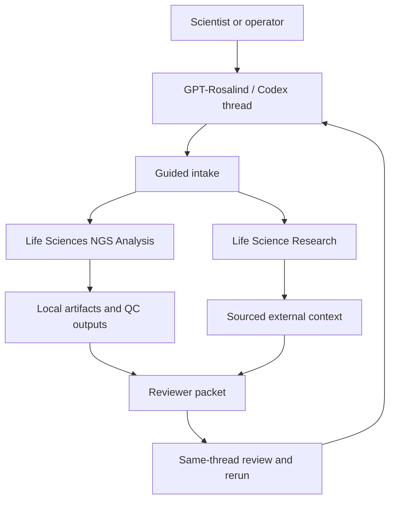

# GPT-Rosalind Workflows

This directory collects the project plans for using GPT-Rosalind, Codex, the Life Sciences NGS Analysis plugin, and the Life Science Research plugin as a scientist-facing workbench around this repository.

The integration goal is practical: use GPT-Rosalind to route analysis, run validated tools, preserve provenance, add sourced biological context, and produce reviewer-ready packets. GPT-Rosalind should not replace the assay, the pipeline, clinical signoff, or the local verifiers.

## Integration Model



The pattern is:

1. Inspect available files before asking questions.
2. Validate sample sheets, references, tools, and metadata before compute-heavy work.
3. Run or route public, reproducible workflows.
4. Return auditable artifacts, not just conclusions.
5. Add sourced external biological context only after sample evidence exists.
6. Keep no-call and blocker states explicit.
7. Let the user fix gaps and rerun in the same thread without losing provenance.

## What The Plugins Are Good At

| Capability | Best tool or skill family | Good for | Boundary |
| --- | --- | --- | --- |
| Top-level sequencing routing | `ngs-analysis-router` | Choosing the right NGS lane from FASTQ, BAM, CRAM, VCF, matrices, or mixed inputs. | It routes; it does not decide clinical meaning. |
| Runtime and reference readiness | `ngs-runtime-env` | Checking tools, package plans, references, indexes, databases, and install/resource blockers. | Should emit reviewable plans before installing or downloading. |
| WGS/WES DNA calling | `ngs-dna-variant-calling`, `ngs-dna-somatic-variants`, `ngs-dna-germline-variants` | Tumor-normal WES/WGS QC, somatic variants, germline context, compact BAM/CRAM checks, and nf-core/sarek handoff. | Full clinical interpretation still needs validated policy and signoff. |
| scRNA-seq post-count analysis | `scrna-seq-qc`, `ngs-scrna-seq` | Matrix-level QC, threshold justification, annotation, UMAPs, and review artifacts. | Tissue-specific annotation and malignant-cell calls need expert review. |
| Bulk RNA-seq FASTQ QC | `ngs-bulk-rnaseq-counts-qc`, `ngs-bulk-rnaseq` | FASTQ/sample-sheet/reference validation, MultiQC, Salmon matrices, and QC interpretation. | It prepares reusable count matrices; downstream biology still needs design-aware analysis. |
| Broad life-science research routing | `research-router-skill` | Classifying a research question, normalizing entities, selecting evidence lanes, and synthesizing findings. | It should not return an unsorted source dump or override failed sample QC. |
| Variant and genetics context | ClinVar, gnomAD, Ensembl, GWAS/OpenTargets-style skills | Variant normalization, pathogenicity context, population frequency, gene-disease evidence. | Public annotations can conflict and must be reconciled. |
| Cancer and translational context | CIViC, cBioPortal, ClinicalTrials.gov, literature skills | Cancer recurrence, clinical evidence, trial landscape, target context. | Not a treatment recommendation. |
| Expression and cell context | Human Protein Atlas, GTEx/Bgee/cellxgene-style skills | Normal-tissue expression, cell-type expression, off-tumor risk context. | RNA expression is not the same as surface protein abundance. |
| Pathway and protein context | UniProt, Reactome, STRING, GO, AlphaFold/PDB skills | Gene function, pathway role, protein context, mechanism summaries. | Mechanism supports interpretation; it does not prove sample-specific actionability. |
| Literature and dataset discovery | NCBI Entrez/PMC, BioStudies/ArrayExpress, NCBI Datasets | Finding papers, public datasets, validation candidates, and source evidence. | Currentness and study design quality must be checked each run. |

## Use Cases In This Directory

| Workflow | Use it when | Main output |
| --- | --- | --- |
| [HRD Workflow](hrd-workflow.md) | You want to assess HRD score readiness from WGS/WES tumor-normal data and integrate sample evidence with sourced HRR context. | HRD adapter status, no-call gates, evidence tables, and reviewer packet. |
| [Broad WGS Delta Workflow](broad-wgs-delta-workflow.md) | You want to ask what WGS adds beyond WES, including structural variants, breakpoints, allele-specific CNV/LOH, noncoding candidates, and mutational signatures. | WGS-vs-WES delta table, CNV/SV/signature boards, target-board updates, and reviewer packet. |
| [Pan-Target Discovery Workflow](target-discovery-workflow.md) | You want to rank ADC, bispecific, CDK12/13, CDK4/6, and other target hypotheses without overcalling WGS/WES evidence. | DNA target-locus evidence, candidate target board, orthogonal follow-up list, and reviewer packet. |
| [TROP-2 ADC Target Workflow](trop2-adc-workflow.md) | You want to evaluate whether TROP-2/`TACSTD2` is a plausible ADC target using bulk WES plus scRNA-seq. | WES target-locus evidence, scRNA target-expression evidence, external ADC context, and target-confidence class. |

## Patterns From The Codex Life-Sciences Use Cases

The Codex life-sciences examples emphasize a consistent workflow shape:

- **Bulk RNA-seq FASTQ QC**: validate sample sheets, FASTQs, and references, then return MultiQC, quantification matrices, provenance, and a short QC interpretation before downstream analysis.
- **scRNA-seq post-count QC**: turn a matrix bundle into threshold-justified filtering summaries, annotations, UMAPs, and portable review artifacts that can be revised in the same thread.
- **Life Sciences collection**: use Codex/GPT-Rosalind to transform sequencing data into biological insights by connecting NGS execution with research synthesis.
- **GPT-Rosalind article**: combine sourced evidence retrieval, biological interpretation, and bioinformatics execution in one workspace while preserving artifacts and provenance for expert review.

For this project, those patterns translate into:

- never returning a bare score when an evidence board is needed;
- treating `ready`, `partial_evidence`, `no_call`, and `blocked` as first-class outputs;
- keeping sample-derived evidence separate from literature/database context;
- preserving run manifests, validation summaries, artifact indexes, and reviewer packets;
- using same-thread iteration to add missing files, metadata, references, or orthogonal validation.

## Project-Specific Boundaries

The current repo has strong public-data validation and reviewer-facing artifact patterns, but these Rosalind workflows are still operating guides.

Important boundaries:

- Diana-specific interpretation still requires Diana files, reference/pairing confirmation, tumor purity context, and reviewer signoff.
- WES can support small variants and limited copy-number hypotheses, but not genome-wide HRD signatures by itself.
- scRNA-seq can support target-expression and heterogeneity review, but ADC target suitability needs protein-level confirmation when possible.
- Public research evidence can support interpretation, but it cannot rescue failed sample QC or missing required inputs.
- High-cost WGS, large transfers, cloud execution, or package installation should require explicit approval.

## Recommended Output Layouts

Use consistent result roots so Rosalind-generated packets are easy to audit:

```text
results/rosalind_hrd/<sample_set>/<run_id>/
results/rosalind_targets/<sample_or_cohort>/<run_id>/
results/rosalind_trop2_adc/<sample_or_cohort>/<run_id>/
results/wgs_broad/<sample_or_cohort>/<run_id>/
```

Common files:

```text
run_manifest.json
input_evidence_index.json
sample_validation_summary.csv
research_context_sources.json
reviewer_packet.md
next_actions.md
```

The `input_evidence_index.json` should point back to existing `results/`, `manifests/`, and source URLs rather than copying large sequencing files.

## Source Material Read

These docs summarize patterns and details from:

- [Introducing new capabilities to GPT-Rosalind](https://openai.com/index/introducing-new-capabilities-to-gpt-rosalind/)
- [Codex Life Sciences collection](https://developers.openai.com/codex/use-cases/collections/life-sciences)
- [Bulk RNA-seq FASTQ QC use case](https://developers.openai.com/codex/use-cases/bulk-rna-seq-fastq-qc)
- [scRNA-seq post-count QC use case](https://developers.openai.com/codex/use-cases/scrna-seq-post-count-qc)
- [Life Science Research plugin](https://github.com/openai/plugins/tree/main/plugins/life-science-research)
- [Life Sciences NGS Analysis plugin](https://github.com/openai/plugins/tree/main/plugins/ngs-analysis)
- current project docs and artifacts under `docs/`, `manifests/`, and `results/`
