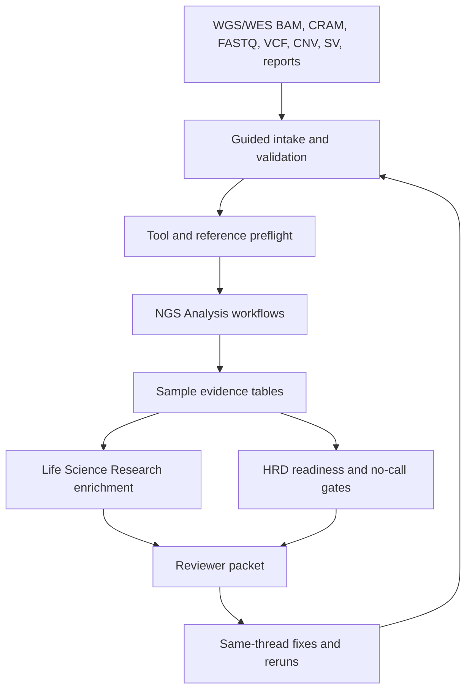

# GPT-Rosalind HRD Workflow

This page describes how we would use GPT-Rosalind, Codex, the Life Sciences NGS Analysis plugin, and the Life Science Research plugin to help compute and review an HRD score from WGS or WES tumor-normal data.

The goal is not to make GPT-Rosalind the assay. The goal is to use it as a guided workbench around validated tools, local artifacts, public evidence, and explicit no-call rules.

## Operating Model

GPT-Rosalind should coordinate two distinct layers:

| Layer | Role | Main responsibility |
| --- | --- | --- |
| NGS execution | Generate internal sample evidence. | Validate BAM/CRAM/FASTQ inputs, run or route variant/CNV/SV/signature workflows, capture QC, and preserve provenance. |
| Research synthesis | Add sourced biological context. | Normalize genes and variants, retrieve ClinVar, gnomAD, CIViC, cBioPortal, pathway, literature, and clinical context, then summarize caveats. |

Use the NGS layer to answer "what is in this sample?" Use the research layer to answer "what does external evidence say about the observed events?"

## Starter Prompt

Use this prompt when Diana's real WGS or WES files are staged, or when a public validation sample is being reviewed in the same pattern:

```text
Use GPT-Rosalind with the NGS Analysis and Life Science Research plugins.

Assess HRD evidence readiness from the provided WGS/WES tumor-normal inputs. Validate sample pairing, file indexes, reference build, target BED if WES, tumor purity when available, and any vendor VCF/CNV/SV files. Run or route the appropriate DNA workflows to generate BAM QC, somatic and germline HRR variant evidence, CNV/LOH readiness, SV readiness, and mutational-signature readiness.

Then use Life Science Research to enrich observed HRR variants and relevant genes with sourced ClinVar, gnomAD, Ensembl, CIViC, cBioPortal, pathway, and literature context.

Return:
- run_manifest.json
- input_validation_summary.csv
- BAM QC and callability summaries
- somatic and germline HRR variant tables
- CNV/LOH/SV/signature readiness summaries
- HRD adapter status table with ready, no-call, or blocked states
- sourced research context tables for observed HRR events
- reviewer_packet.md with evidence, caveats, no-call reasons, and next actions
```

## Workflow Stages



### 1. Guided Intake

GPT-Rosalind should first inspect available files and metadata before asking questions. It should resolve:

- WGS versus WES.
- FASTQ, BAM, CRAM, VCF, CNV, SV, or mixed vendor-derived inputs.
- Tumor-normal pairing and `pair_id`.
- Reference build and contig naming.
- BAM/CRAM index availability.
- WES target BED and bait BED, if applicable.
- Tumor purity, ploidy, collection timing, and vendor notes when known.
- Whether cloud upload is allowed for human data.

Local project commands remain the source of truth for Diana intake:

```sh
PYTHONPATH=src /usr/bin/python3 -m diana_omics build:diana-template
DIANA_RAW_SAMPLESHEET=manifests/diana_raw_inputs.csv DIANA_RAW_REQUIRE_DATA=1 PYTHONPATH=src /usr/bin/python3 -m diana_omics verify:diana-raw
DIANA_RAW_SAMPLESHEET=manifests/diana_raw_inputs.csv DIANA_RAW_REQUIRE_DATA=1 PYTHONPATH=src /usr/bin/python3 -m diana_omics stage:diana-raw
```

Passing intake validation means the files are staged correctly. It does not mean an HRD score is available.

### 2. Runtime And Reference Preflight

Before compute-heavy analysis, GPT-Rosalind should use the NGS Analysis runtime pattern to check:

- local tools such as `samtools`, `bcftools`, GATK, Nextflow, and container runtime;
- reference FASTA, indexes, known-sites resources, germline resource, and panel of normals;
- target BED compatibility for WES;
- disk and runtime constraints for WGS-scale work.

The expected output is a reviewable install/resource plan, not silent installation.

### 3. NGS Evidence Generation

For tumor-normal WGS or WES, route through:

| Need | Preferred skill or workflow | Output |
| --- | --- | --- |
| DNA route selection | `ngs-analysis-router`, `ngs-dna-variant-calling` | Selected germline, somatic, or compact BAM/CRAM path. |
| Tumor-normal somatic calls | `ngs-dna-somatic-variants` or nf-core/sarek | Somatic VCF, pair review, contamination/filtering status. |
| Germline HRR calls | `ngs-dna-germline-variants` | Germline VCF/gVCF and known-sites/resource status. |
| Focused BAM/CRAM QC | `run_dna_variant_calling.py` compact runner | Flagstat, idxstats, coverage, callability, focused VCF. |
| Public sidecar validation | Existing `diana_omics` commands | SEQC2, HG008, COLO829 benchmark summaries. |

The local project still owns its current validated evidence surfaces:

- BAM validation summaries.
- Somatic small-variant calls.
- Coverage-CNV bins.
- SBS96 mutation context.
- SV evidence summaries.
- Public known-answer validations.

### 4. HRD Adapter Gates

The HRD score should be assembled from explicit adapter states, not inferred from one proxy table.

| Adapter | Required input | Ready condition | No-call condition |
| --- | --- | --- | --- |
| HRR event evidence | Somatic and germline SNV/indel calls with annotations. | HRR variants are normalized, filtered, and classified with source context. | Variant calls are missing, reference-mismatched, or unreviewed. |
| Biallelic/LOH evidence | Allele-specific CNV/LOH segments plus purity/ploidy. | HRR locus allele state can be assessed. | Only GISTIC, coverage bins, or non-allele-specific copy data exist. |
| SBS3 | Validated SBS96/SBS288 matrix and minimum mutation policy. | Matrix and reconstruction QC pass locked thresholds. | Mutation burden or signature policy is insufficient. |
| scarHRD | Allele-specific total/minor copy-number segments. | LOH, LST, and TAI can be computed under locked thresholds. | Allele-specific CNV segments are unavailable. |
| CHORD | Somatic SNV/indel features plus validated SV caller VCF/BEDPE and CNV context. | Required feature classes pass caller validation. | Production SV caller output is missing or unvalidated. |
| HRDetect-style model | Locked feature vector across substitutions, indels, rearrangements, and CNV/LOH. | All feature adapters and model calibration are validated. | Component adapters are incomplete or thresholds are not locked. |

The existing readiness artifact is the canonical starting point:

```text
results/clinicalization/hrd_interpretation_readiness_summary.csv
```

GPT-Rosalind should promote that table into a reviewer-facing board with ready, no-call, and blocked states.

### 5. Research Enrichment

After sample evidence is generated, use the Life Science Research plugin to annotate observed HRR events and mechanism context.

| Question | Useful research skill family | Output |
| --- | --- | --- |
| Is this variant reported as pathogenic or uncertain? | ClinVar, Ensembl, gnomAD | Variant context, transcript normalization, population frequency. |
| Is this alteration recurrent or clinically discussed in cancer? | CIViC, cBioPortal, literature | Cancer evidence table with source caveats. |
| What is the gene's role in HR repair? | UniProt, Reactome, STRING, GO | Pathway and functional context. |
| Are there relevant clinical or translational studies? | ClinicalTrials.gov, PharmGKB, literature | Translational context when requested. |
| Are there public datasets useful for validation? | NCBI Datasets, BioStudies/ArrayExpress, literature | Candidate validation datasets. |

Research enrichment must stay separate from sample evidence. A literature claim should never override a failed sample QC gate.

### 6. Reviewer Packet

The final output should be a review surface, not just a scalar score.

Required packet sections:

1. Input inventory and provenance.
2. Pairing, reference, and runtime preflight status.
3. BAM/CRAM QC and callability.
4. Somatic and germline HRR events.
5. Allele-state and LOH readiness.
6. CNV, SV, and signature readiness.
7. HRD adapter status table.
8. External research context for observed events.
9. Public truth-set sidecar status.
10. Score or no-call conclusion.
11. Limitations and next actions.

If all required adapters pass, the packet can report the locked HRD score and component values. If any required adapter is missing, it should report a no-call or partial evidence state with the exact blocker.

For the terminal Diana WGS run, bind Rosalind to both the final worker artifact
root and the deterministic report packet staged from frozen artifacts:

```sh
env \
  ROSALIND_HRD_SAMPLE_SET=diana_wgs \
  ROSALIND_HRD_RUN_ID=<run_id> \
  ROSALIND_HRD_ARTIFACT_ROOT=<materialized-final-artifact-root> \
  ROSALIND_HRD_DETERMINISTIC_REPORT_DIR=<deterministic_full_wgs-report-dir> \
  ROSALIND_HRD_FORBIDDEN_TOKENS_JSON='["<private-token>"]' \
  PYTHONPATH=src \
  /usr/bin/python3 -m diana_omics build:rosalind-hrd-packet
```

The deterministic directory must contain `report.md`, `readiness.csv`,
`evidence_checks.json`, `input_sha256.csv`, and `report_manifest.json` from
`scripts/stage_deterministic_wgs_report.py`; Rosalind treats that custody-bound
packet as the deterministic source of record and preserves its
`partial_evidence` / `no_call` boundary.

## Score Policy

Use these terms consistently:

| Term | Meaning |
| --- | --- |
| `score_ready` | Required evidence exists, QC passes, thresholds are locked, and validation sidecar is acceptable. |
| `partial_evidence` | Some HRD-supporting evidence exists, but not enough for the selected score. |
| `no_call` | The score cannot be computed because required inputs are unavailable or invalid. |
| `blocked` | The analysis cannot proceed without missing files, tools, references, approval, or reviewer policy. |

Do not label a WES-only copy-number proxy as scarHRD unless allele-specific segments and a validated scarHRD policy are present. Do not label SBS3 or HRDetect-style results as final unless minimum mutation thresholds, feature definitions, model calibration, and known-answer performance are locked.

## Same-Thread Iteration

GPT-Rosalind is most useful after the first packet, when the user can fix gaps in the same thread:

- add a missing matched normal;
- provide the correct target BED;
- correct reference-build metadata;
- add allele-specific CNV segments;
- add production SV VCF/BEDPE;
- supply tumor purity/ploidy estimates;
- rerun only the blocked HRD adapter;
- ask for sourced context on a specific HRR event.

Each rerun should preserve the previous packet and write a new manifest so reviewer rationale is not lost.

## Running Validated Samples

Use this section when we want GPT-Rosalind to run the HRD workflow on public or local samples we already have access to and have already validated. These samples should be treated as calibration and workflow-demonstration cases before Diana-specific interpretation.

### Sample Selection

| Sample set | Current validation status | Use in GPT-Rosalind workflow | Allowed HRD conclusion |
| --- | --- | --- | --- |
| SEQC2/HCC1395 WES | Full FASTQ-to-BAM-to-Mutect2 truth benchmark passed. | Demonstrate WES tumor-normal intake, BAM QC, small-variant calling, contamination checks, and HRR variant review. | WES small-variant evidence only; no genome-wide HRD score. |
| SEQC2/HCC1395 WGS | Full-source WGS mechanics passed with BAM, VCF, CNV-bin, SBS96, and SV-evidence artifacts. | Demonstrate the closest current WGS HRD evidence packet and readiness/no-call board. | Partial HRD evidence; no final scarHRD, CHORD, or HRDetect-style call until production CNV/SV/signature adapters are validated. |
| GIAB HG008 tumor-normal WGS | Bounded SNV and CNV truth probes passed. | Demonstrate Diana-like truth-set review and define the next full caller-benchmarking run. | No HRD call; use for correctness validation of SNV/CNV/SV pipelines. |
| COLO829/COLO829BL WGS | BRAF V600E recovered across four public platform pairs. | Demonstrate multi-platform tumor-normal review and driver-context enrichment. | HRD-negative or HRD-positive claims are not allowed from the driver guardrail alone. |
| COLO829 purity series | Metadata confirmed; local indexing or transfer is still needed. | Plan dilution/sensitivity workflow after selected files are transferred and indexed. | Blocked until local indexed inputs exist. |
| Seraseq ctDNA MRD mix | Request or purchase target only. | Plan future MRD-like positive/negative and limit-of-detection validation. | Blocked until material or variant files are obtained. |

### Recommended Run Order

Run the validated samples in this order:

1. **SEQC2/HCC1395 WES** to prove the WES path and reviewer packet shape.
2. **SEQC2/HCC1395 WGS** to exercise the HRD evidence surfaces: small variants, coverage CNV bins, SBS96, and SV evidence.
3. **GIAB HG008** to pressure-test correctness against independent NIST tumor-normal truth.
4. **COLO829/COLO829BL** to show independent driver recovery and multi-platform BAM handling.
5. **COLO829 purity series** only after transfer/indexing is complete.
6. **Seraseq ctDNA MRD** only after access is approved and expected positive/negative ranges are defined.

This order keeps the first GPT-Rosalind demonstration grounded in passing local artifacts, then moves toward more demanding validation.

### Starter Prompt For A Validated Sample

Use this prompt when the goal is to run the Rosalind-style packet on one of the already validated sample sets:

```text
Use GPT-Rosalind with the NGS Analysis and Life Science Research plugins.

Run the HRD evidence-readiness workflow for <sample_set>. Start from the existing validated artifacts and manifests in this repository. Do not rerun high-cost WGS compute unless explicitly approved. First inspect the existing result summaries, validation reports, and readiness tables. Then produce a sample-specific reviewer packet that states:

- which input files or public assets were used;
- which validations have already passed;
- which HRD evidence surfaces exist for this sample;
- which HRD adapters are ready, no-call, or blocked;
- which external research context is relevant to observed HRR or driver events;
- what exact additional files or tools are needed before a scalar HRD score can be computed.

Preserve a strict boundary between sample evidence, public validation evidence, and literature or database context.
```

### Existing Commands And Artifacts

Use existing outputs before scheduling new compute:

| Sample set | Command or artifact to start from | Primary files to review |
| --- | --- | --- |
| SEQC2/HCC1395 WES | `PYTHONPATH=src /usr/bin/python3 -m diana_omics benchmark:full-wes` | `results/full_wes_benchmark/full_wes_benchmark_summary.json`, `results/full_wes_benchmark/truth_overlap_benchmark_summary.json`, `results/full_wes_benchmark/full_wes_bam_validation.csv` |
| SEQC2/HCC1395 WGS | `PYTHONPATH=src /usr/bin/python3 -m diana_omics validate:phase3-wgs` | `results/phase3_wgs_smoke/phase3_wgs_summary.json`, `results/phase3_wgs_smoke/coverage_cnv_bins.csv`, `results/phase3_wgs_smoke/wgs_sbs96_matrix.csv`, `results/phase3_wgs_smoke/sv_evidence_summary.csv`, `results/phase3_wgs_smoke/hrd_tool_readiness_summary.csv` |
| GIAB HG008 | `PYTHONPATH=src /usr/bin/python3 -m diana_omics run:known-answer-expanded-cohort` | `results/clinicalization/known_answer_runs/hg008/small_variant_concordance_summary.json`, `results/clinicalization/known_answer_runs/expanded_cohort/hg008_cnv_sweep.json`, `results/clinicalization/known_answer_runs/hg008/sv_cnv_reciprocal_overlap_summary.json` |
| COLO829/COLO829BL | `PYTHONPATH=src /usr/bin/python3 -m diana_omics run:known-answer-expanded-cohort` | `results/clinicalization/known_answer_runs/colo829/input_provenance_summary.json`, `results/clinicalization/known_answer_runs/colo829/sv_cna_reciprocal_overlap_summary.json`, `results/clinicalization/known_answer_runs/expanded_cohort/colo829_platform_*.json` |
| Expanded validation rollup | `PYTHONPATH=src /usr/bin/python3 -m diana_omics verify:orthogonal` | `results/clinicalization/known_answer_expanded_cohort_execution.md`, `results/clinicalization/known_answer_expanded_cohort_execution.json` |
| HRD adapter readiness | `PYTHONPATH=src /usr/bin/python3 -m diana_omics verify:hrd-interpretation-readiness` | `results/clinicalization/hrd_interpretation_readiness_summary.csv`, `results/clinicalization/hrd_interpretation_readiness_summary.json` |

If a command would trigger full WGS alignment, large transfer, AWS Batch, or other high-cost work, GPT-Rosalind should stop and ask for explicit approval.

### SEQC2/HCC1395 WES Packet

Use HCC1395 WES to demonstrate the WES route:

- confirm four FASTQs validated;
- confirm tumor-normal BAM validation passed;
- summarize Mutect2/FilterMutectCalls and contamination status;
- report exact truth-overlap counts, recall, and precision;
- enrich any observed HRR event with Life Science Research only after the sample evidence table exists.

Allowed conclusion:

```text
This sample demonstrates WES small-variant and caller-readiness behavior. It does not support a genome-wide HRD scar, SV, SBS3, CHORD, or HRDetect-style score.
```

Current materialized-artifact smoke: `hcc1395-wes-materialized-20260617`, using `artifacts/hcc1395_wes_validation`. This small artifact root contains only WES benchmark summary outputs and known-answer rollup JSON, not FASTQs, BAMs, VCFs, or reference files. The cloud run `cloud-hcc1395-wes-20260617` exercised the same root through AWS Batch and reproduced the WES packet with 5 evidence rows, 6 adapter rows, and 0 packet blockers while preserving WES-only HRD no-call boundaries.

### SEQC2/HCC1395 WGS Packet

Use HCC1395 WGS as the current best HRD evidence-surface demonstration:

- review full-source WGS pair metadata from `manifests/phase3_wgs_smoke_samplesheet.csv`;
- summarize BAM validation, filtered VCF output, truth-depth checks, coverage CNV bins, SBS96 records, and SV evidence;
- report `hrd_tool_readiness_summary` and `hrd_interpretation_readiness_summary` states;
- enrich relevant HRR events, if present, with sourced variant and pathway context;
- explicitly identify missing production adapters.

Allowed conclusion:

```text
This sample exercises the WGS evidence surfaces needed for HRD review. It remains a partial HRD evidence packet until allele-specific CNV/LOH, production SV calls, signature thresholds, CHORD/scarHRD/HRDetect policy, and known-answer performance are locked.
```

### GIAB HG008 Packet

Use HG008 to validate correctness rather than to infer HRD:

- summarize `40/40` bounded somatic SNV truth confirmations;
- summarize `4/4` CNV depth-direction confirmations;
- report missing full caller-level small-variant, SV, and CNV reciprocal-overlap results;
- use the research layer only for dataset and benchmark context, not disease interpretation.

Allowed conclusion:

```text
HG008 is a truth-set validation sample. It should improve confidence in caller correctness and CNV/SV benchmarking, not produce a Diana-style HRD interpretation.
```

Current refined packet: `public-evidence-hg008-depth-20260617`. It preserves the HG008 no-HRD-interpretation boundary, credits `40/40` SNV truth confirmations and `4/4` bounded CNV depth-direction confirmations, and narrows the remaining HG008 blockers to missing Diana-generated CNV segment overlap and SV reciprocal-overlap outputs.

Current materialized-artifact smoke: `hg008-depth-materialized-20260617`, using `artifacts/hg008_depth_validation`. This small artifact root contains only known-answer summary JSON files and can be used with `--sample-set hg008 --artifact-root-rel artifacts/hg008_depth_validation` for bounded cloud packet validation.

### COLO829 Packet

Use COLO829/COLO829BL to demonstrate an independent tumor-normal guardrail:

- summarize BRAF V600E recovery in tumor and normal-reference behavior across available platform pairs;
- note platform-specific caveats for Illumina, PacBio, Oxford Nanopore, and phased NovaSeq data;
- enrich BRAF V600E through the research layer as a driver-context example;
- report SV/CNA truth assets as present but not yet benchmarked against Diana-generated calls.

Allowed conclusion:

```text
COLO829 is an independent tumor-normal and driver-recovery guardrail. It does not establish HRD status until full SV/CNA/signature evidence is generated and benchmarked.
```

Current materialized-artifact smoke: `colo829-guardrail-materialized-20260617`, using `artifacts/colo829_guardrail`. This small artifact root contains only known-answer summary JSON files and can be used with `--sample-set colo829 --artifact-root-rel artifacts/colo829_guardrail` for bounded cloud packet validation. The cloud run `cloud-colo829-guardrail-20260617` exercised the same root through AWS Batch and reproduced the COLO829 packet with 9 evidence rows, 4 adapter rows, and 4 explicit blockers. The packet remains blocked on build-matched SV/CNA caller output and local transfer or indexing of selected purity assets.

### Diana Raw-Intake Packet

Use Diana raw intake to prove the arrival contract before Dinah's actual files are available:

- preserve the `manifests/diana_raw_inputs.template.csv` column contract;
- keep the `plan:diana-raw-handoff` checklist current before actual paths arrive;
- keep the strict validation command and staging command visible in the packet;
- require actual BAM/FASTQ/CRAM paths, indexes, reference metadata, and tumor-normal pairing before compute;
- keep HRD interpretation `no_call` until strict file validation and downstream feature lanes pass.

Allowed conclusion:

```text
This packet proves the raw-data intake contract is ready. It does not validate Diana files or produce HRD evidence until the actual BAM/FASTQ/CRAM paths are supplied and pass strict intake validation.
```

Current materialized-artifact smoke: `diana-raw-intake-handoff-materialized-20260617`, using `artifacts/diana_raw_intake_ready`. This small artifact root contains only the intake template, operations runbook, handoff plan, and readiness summary files and can be used with `--sample-set diana_raw_intake --artifact-root-rel artifacts/diana_raw_intake_ready` for bounded cloud packet validation. The cloud run `cloud-diana-raw-intake-handoff-20260617` exercised the same root through AWS Batch and reproduced the handoff-aware packet with 5 evidence rows, 4 adapter rows, and 1 file-arrival blocker. The current handoff runbook is `results/diana_raw_intake/dinah_handoff_plan.md`; it records the strict validation, staging, packet refresh, triage refresh, cloud-upload permission gate, and first compute-lane routing boundary for when Dinah's real paths arrive.

### Output Layout For Validated Sample Runs

For sample-specific GPT-Rosalind packets, write outputs under:

```text
results/rosalind_hrd/<sample_set>/<run_id>/
```

Recommended files:

```text
run_manifest.json
input_evidence_index.json
sample_validation_summary.csv
hrd_adapter_status.csv
research_context_sources.json
reviewer_packet.md
next_actions.md
```

The `input_evidence_index.json` should point back to the existing `results/` and `manifests/` files used, so the packet is reproducible without copying large BAMs or FASTQs.

### Cloud Materialized Packet Smoke

The current cloud-ready proofs are `cloud-hcc1395-wes-20260617`, `cloud-selective5-20260617`, `cloud-helper-selective5-20260617`, `cloud-hg008-depth-20260617`, `cloud-colo829-guardrail-20260617`, `cloud-diana-raw-intake-20260617`, and `cloud-diana-raw-intake-handoff-20260617`, all run on AWS Batch on 2026-06-17. They used pushed GitHub archives, materialized bounded evidence roots inside the container, and ran the packet builder with `ROSALIND_HRD_ARTIFACT_ROOT`.

| Run ID | Batch job | Status | Sample set | Evidence rows | Adapter rows | Packet blockers |
| --- | --- | --- | --- | --- | --- | --- |
| `cloud-hcc1395-wes-20260617` | `e616e07e-2a4a-479d-a305-33e1e67df13f` | `SUCCEEDED` | `hcc1395_wes` | `5` | `6` | `0` |
| `cloud-selective5-20260617` | `573cd3de-afe9-4949-80a2-8ba0a523c300` | `SUCCEEDED` | `hcc1395_wgs` | `7` | `7` | `0` |
| `cloud-helper-selective5-20260617` | `e8d00f20-26c8-4a32-8198-8aa10c916859` | `SUCCEEDED` | `hcc1395_wgs` | `7` | `7` | `0` |
| `cloud-hg008-depth-20260617` | `8a01caf6-5439-4c54-b068-2ecd5d325269` | `SUCCEEDED` | `hg008` | `4` | `4` | `2` |
| `cloud-colo829-guardrail-20260617` | `477dc868-d16a-4bad-a58d-2794b2ed0f91` | `SUCCEEDED` | `colo829` | `9` | `4` | `4` |
| `cloud-diana-raw-intake-20260617` | `5640a9f1-8f8c-4560-a8dc-338f3b39c655` | `SUCCEEDED` | `diana_raw_intake` | `4` | `4` | `1` |
| `cloud-diana-raw-intake-handoff-20260617` | `d868a987-79d1-4aa1-93f0-433fbde91686` | `SUCCEEDED` | `diana_raw_intake` | `5` | `4` | `1` |

Cloud output was written to:

```text
s3://diana-omics-results-172630973301-us-east-1/runs/rosalind_hrd/cloud-hcc1395-wes-20260617
s3://diana-omics-results-172630973301-us-east-1/runs/rosalind_hrd/cloud-selective5-20260617
s3://diana-omics-results-172630973301-us-east-1/runs/rosalind_hrd/cloud-helper-selective5-20260617
s3://diana-omics-results-172630973301-us-east-1/runs/rosalind_hrd/cloud-hg008-depth-20260617
s3://diana-omics-results-172630973301-us-east-1/runs/rosalind_hrd/cloud-colo829-guardrail-20260617
s3://diana-omics-results-172630973301-us-east-1/runs/rosalind_hrd/cloud-diana-raw-intake-20260617
s3://diana-omics-results-172630973301-us-east-1/runs/rosalind_hrd/cloud-diana-raw-intake-handoff-20260617
```

Committed evidence is available under:

```text
results/rosalind_hrd/cloud-hcc1395-wes-20260617/
results/rosalind_hrd/hcc1395_wes/cloud-hcc1395-wes-20260617/
results/rosalind_hrd/cloud-selective5-20260617/
results/rosalind_hrd/hcc1395_wgs/cloud-selective5-20260617/
results/rosalind_hrd/cloud-helper-selective5-20260617/
results/rosalind_hrd/hcc1395_wgs/cloud-helper-selective5-20260617/
results/rosalind_hrd/cloud-hg008-depth-20260617/
results/rosalind_hrd/hg008/cloud-hg008-depth-20260617/
results/rosalind_hrd/cloud-colo829-guardrail-20260617/
results/rosalind_hrd/colo829/cloud-colo829-guardrail-20260617/
results/rosalind_hrd/cloud-diana-raw-intake-20260617/
results/rosalind_hrd/diana_raw_intake/cloud-diana-raw-intake-20260617/
results/rosalind_hrd/cloud-diana-raw-intake-handoff-20260617/
results/rosalind_hrd/diana_raw_intake/cloud-diana-raw-intake-handoff-20260617/
```

These runs prove the lightweight packet builder can run in Batch against materialized artifacts and produce reviewer-packet outputs without uploading local generated data. They do not prove full WGS compute or a final HRD score. The generated packets keep SBS3, scarHRD, CHORD, and HRDetect-style interpretation behind their current no-call boundaries until production adapters, thresholds, and known-answer performance are locked.

Future cloud packet runs should use the repo task wrapper:

```sh
PYTHONPATH=src /usr/bin/python3 -m diana_omics aws:hrd-packet:cloud-submit -- --dry-run
PYTHONPATH=src /usr/bin/python3 -m diana_omics aws:hrd-packet:cloud-submit -- --run-id cloud-selective5-YYYYMMDD
```

### Readiness Triage Board

After generating packets, refresh the blocker triage board:

```sh
ROSALIND_HRD_TRIAGE_PACKET_RUN=<packet_run_id> ROSALIND_HRD_TRIAGE_ID=<triage_id> PYTHONPATH=src /usr/bin/python3 -m diana_omics triage:rosalind-hrd-readiness
```

The triage board compares the selected all-sample packet with materialized packet runs. It is the place to record that the repo-root HCC1395 WGS metadata-only blocker is closed by the selective materialized/cloud packets and that HCC1395 WES now has local/cloud materialized closures, while HG008, COLO829, and Diana raw intake still have true caller, indexing, build-reconciliation, or file-arrival blockers. The current public-cloud triage run is `readiness-triage-public-cloud-20260617`, based on `public-evidence-hg008-depth-20260617`.

## Source Pattern

This design follows the OpenAI life-sciences workflow pattern documented in:

- [Introducing new capabilities to GPT-Rosalind](https://openai.com/index/introducing-new-capabilities-to-gpt-rosalind/)
- [Codex Life Sciences collection](https://developers.openai.com/codex/use-cases/collections/life-sciences)
- [Bulk RNA-seq FASTQ QC use case](https://developers.openai.com/codex/use-cases/bulk-rna-seq-fastq-qc)
- [scRNA-seq post-count QC use case](https://developers.openai.com/codex/use-cases/scrna-seq-post-count-qc)
- [Life Science Research plugin](https://github.com/openai/plugins/tree/main/plugins/life-science-research)
- [Life Sciences NGS Analysis plugin](https://github.com/openai/plugins/tree/main/plugins/ngs-analysis)
