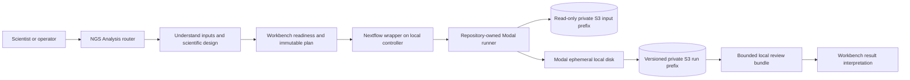

# Modal + S3 + NGS plugin replication guide

This guide documents the reusable pattern behind the E019 ImmunoID TROP-2 RNA analysis. It is for operators who have authorized access to this repository, the private S3 prefixes, and the Diana Modal workspace.

The pattern has two deliberately separate control layers:

- The **NGS Analysis plugin and NGS Analysis Workbench** establish the assay, scientific question, required metadata, workflow choice, readiness, execution plan, lifecycle, and interpretation boundary.
- The **repository-owned Modal runner** performs the private large-file computation against narrowly mounted S3 prefixes and writes an immutable, checksummed result envelope.

The plugin does not make the custom Modal runner scientifically valid merely by invoking it, and Modal does not replace analysis design or result review merely by finishing a function.

## Reference implementation

The exact implementation described here is a focused, single-sample bulk-RNA check:

- Question: does the E019 ImmunoID tumor RNA dataset contain reproducible `TACSTD2`/TROP-2 transcript-aligned signal worth protein-level follow-up?
- Input: paired FASTQs plus two indexed vendor RNA BAM forms on GRCh37/hs37d5.
- Runtime: Modal in `us-east`, with a read-only input bucket mount and a private output bucket mount.
- Result: `partial_evidence` supporting transcript presence under recorded QC rules.
- Not supported: differential expression, cross-sample abundance, malignant-cell specificity, membrane localization, ADC eligibility, response, or treatment benefit.

Start with these repository files:

| File | Purpose |
| --- | --- |
| [`manifests/rosalind_trop2_rna_inputs.csv`](../../manifests/rosalind_trop2_rna_inputs.csv) | Exact input URIs, sizes, vendor MD5s, SHA-256 records, reference, and S3 VersionIds. |
| [`scripts/modal/modal_s3_bulk_rna_trop2.py`](../../scripts/modal/modal_s3_bulk_rna_trop2.py) | Modal image, restricted S3 mounts, preflight, FastQC/MultiQC, BAM QA, focused counting, output schemas, and download-only recovery. |
| [`src/diana_omics/trop2_rna.py`](../../src/diana_omics/trop2_rna.py) | Shared comparison and depth-summary logic. |
| [`workflows/trop2_modal_corrective/`](../../workflows/trop2_modal_corrective/) | Nextflow wrapper used to register and operate a durable Workbench run while delegating heavy compute to Modal. |
| [`docs/rosalind/bulk-rna-trop2-modal-s3.md`](bulk-rna-trop2-modal-s3.md) | Scientific method, QA thresholds, corrected findings, optimization notes, and evidence boundary. |
| [`results/workbench/immunoid-trop2-qafix-20260904T154652Z-recovery/`](../../results/workbench/immunoid-trop2-qafix-20260904T154652Z-recovery/) | Completed corrective Workbench run and bounded result projection. |

The companion [prompt library](modal-s3-ngs-plugin-prompts.md) turns the procedures below into copy-and-paste requests for Codex and Rosalind Workbench.

### Pan-cancer ADC Atlas extension

The generalized implementation replaces the locus diagnostic with transcript-aware quantification and joins only a bounded 23-target table to the public atlas:

| File | Purpose |
| --- | --- |
| [`manifests/adc_atlas_targets_v1.csv`](../../manifests/adc_atlas_targets_v1.csv) | Frozen pan-cancer ADC target, alias, payload-context, protein-gate, and caveat contract. |
| [`scripts/modal/modal_s3_adc_atlas_patient_bridge.py`](../../scripts/modal/modal_s3_adc_atlas_patient_bridge.py) | Exact S3 input mount, decoy-aware Salmon run, QA, gene aggregation, TCGA-BRCA banding, private result write, and bounded projection. |
| [`src/diana_omics/adc_patient_bridge.py`](../../src/diana_omics/adc_patient_bridge.py) | Transcript-to-gene aggregation, within-sample ranking, and coarse cohort-band logic. |
| [`workflows/adc_atlas_patient_bridge/`](../../workflows/adc_atlas_patient_bridge/) | Saved Nextflow wrapper used by NGS Analysis Workbench. |
| [`results/workbench/adc-atlas-patient-bridge-20260904T183020Z-projection/`](../../results/workbench/adc-atlas-patient-bridge-20260904T183020Z-projection/) | Completed Workbench projection and agent-authored interpretation of the newly recomputed run. |
| [`results/pan_cancer_adc_atlas/v1/`](../../results/pan_cancer_adc_atlas/v1/) | Public TCGA/GTEx/HPA aggregates, directional Diana lane, protein follow-up queue, manifests, and artifact hashes. |

This extension caches only the integrity-checked GENCODE v23/GRCh38.p3 full-genome-decoy reference. Every patient result keeps a new immutable run ID. The completed run inferred ISR, mapped 72.45% of fragments, mapped all quantified transcripts to genes, preserved a 1,000,000 TPM sum, and covered all 23 targets. The TCGA-BRCA comparison remains directional because Salmon and Toil/RSEM, library preparation, specimen composition, and batch differ.

## Architecture



### Ownership boundaries

| Layer | Owns | Does not establish |
| --- | --- | --- |
| NGS Analysis router | Input/assay routing and missing-essential detection. | Scientific validity or execution readiness. |
| NGS scientific design | Experimental unit, endpoint, reference, comparisons, evidence contract, and no-call rules. | Installed tools or runnable compute. |
| NGS Workbench execution | Workflow/target discovery, readiness, plan identity, native approval, run lifecycle, and saved review. | Valid QC or a biological finding without inspecting outputs. |
| Modal | Isolated compute, requested resources, and access to named secrets and S3 mounts. | Input identity, study design, or clinical meaning. |
| S3 | Versioned input custody and immutable run-specific output storage. | Artifact correctness merely because an object exists. |
| Repository runner | Exact commands, thresholds, schemas, artifact indexes, and completion-marker order. | Surface protein, response prediction, or treatment recommendation. |

## Access and safety prerequisites

An operator needs all of the following:

1. Read access limited to:

   ```text
   s3://diana-omics-raw-inputs-172630973301-us-east-1/diana/inbox/2026-07-14-echo-personalis/data/immunoid/
   ```

2. Write access to new run-specific prefixes beneath:

   ```text
   s3://diana-omics-private-results-172630973301-us-east-1/modal/rosalind-rnaseq-trop2/runs/
   ```

3. Access to the Diana Modal workspace and its named AWS secret. The default secret name is `onco-omics-use1`; the secret values must never be placed in prompts, shell arguments, source files, manifests, logs, or screenshots.
4. A local clone of this repository with Python, the Modal CLI, and, for registered Workbench runs, Nextflow.
5. The NGS Analysis plugin for assay routing and tool/resource preflight. The plugin is installed separately and is not vendored into this repository. Use NGS Analysis Workbench as well when durable planning, native approval, monitoring, recovery, and run-history interpretation are required.

The S3 path and Modal secret name are identifiers, not credentials. Do not print environment values, AWS keys, Modal tokens, or bucket-policy material while checking access.

## What the reference runner actually does

The runner is intentionally not a general RNA-seq pipeline. It currently binds:

- one fixed input prefix;
- one paired FASTQ sample;
- two indexed RNA BAM processing states;
- one pinned `TACSTD2` locus and canonical coding interval on GRCh37/hs37d5;
- FastQC 0.11.9, MultiQC 1.31, samtools 1.16.1, and matplotlib 3.10.6 in the completed corrective run;
- MAPQ 20 and base-quality 20 depth filters, exclusion mask `0xF04`, and paired-overlap suppression;
- a new immutable output prefix for every `run_id`.

The runner currently carries its own source-object constants mirroring `manifests/rosalind_trop2_rna_inputs.csv`; it does not load that CSV dynamically. The checked-in manifest is the human-reviewable custody record, while the runner constants are the executed contract. Any future sample change must parameterize and validate this relationship rather than updating only one copy.

The input mount is read-only. Artifacts are created on Modal's local ephemeral filesystem and copied to S3 sequentially. `artifact_index.json` binds output sizes and hashes, and `run_manifest.json` is copied last as the completion marker. The runner refuses to overwrite an existing run prefix.

## Direct reproduction with Modal

The direct route replays the repository-owned computation and downloads a bounded review bundle. It does not create a Workbench registry entry.

### 1. Record the source state

From the repository root:

```sh
git status --short --branch
git rev-parse HEAD
shasum -a 256 scripts/modal/modal_s3_bulk_rna_trop2.py src/diana_omics/trop2_rna.py
```

Do not silently include unrelated dirty files in the run provenance. If the runner or helper is dirty, record that fact and their actual SHA-256 values.

### 2. Review the input contract

```sh
sed -n '1,20p' manifests/rosalind_trop2_rna_inputs.csv
```

Confirm the sample, assay, roles, reference, object sizes, and VersionIds. Do not replace the manifest with a broad bucket listing.

### 3. Run the inexpensive remote preflight

```sh
modal run scripts/modal/modal_s3_bulk_rna_trop2.py --preflight-only
```

Preflight checks the required mounted objects and the post-processing runtime. It does not create an analysis run prefix.

### 4. Execute one new immutable run

Choose an explicit UTC-stamped ID. Never reuse an earlier run ID.

```sh
RUN_ID=immunoid-trop2-YYYYMMDDThhmmssZ
REVIEW_DIR=results/rosalind_trop2_adc/echo_personalis/$RUN_ID

modal run scripts/modal/modal_s3_bulk_rna_trop2.py \
  --run-id "$RUN_ID" \
  --download-dir "$REVIEW_DIR"
```

The complete result stays in S3. The local directory receives only the bounded review bundle defined by `REVIEW_BUNDLE_RELATIVE_PATHS` in the runner.

### 5. Verify before interpreting

At minimum, verify:

- `run_manifest.json` exists and names the expected `runId` and output prefix;
- the manifest status is terminal and its evidence boundary is present;
- `artifact_index.json` has the same run ID;
- every locally downloaded artifact represented in the index matches its recorded byte count and SHA-256;
- the artifact-index file itself matches the hash recorded in `run_manifest.json`;
- `qa_summary.json`, `differential_expression_status.json`, and the primary tables agree on units and status;
- any S3-only artifacts are explicitly reported as not independently re-hashed locally.

Do not treat a successful Modal function or the presence of `run_manifest.json` as scientific acceptance.

### 6. Recover a completed run without recomputing

If Modal finished and wrote the immutable S3 run but the local result transfer failed, recover the bounded bundle:

```sh
RUN_ID=immunoid-trop2-YYYYMMDDThhmmssZ
REVIEW_DIR=results/rosalind_trop2_adc/echo_personalis/$RUN_ID

modal run scripts/modal/modal_s3_bulk_rna_trop2.py \
  --run-id "$RUN_ID" \
  --download-only \
  --download-dir "$REVIEW_DIR"
```

Use `--download-only` only after verifying that the S3 run is complete. Recovery must not create a replacement run or overwrite the original result.

## Durable reproduction through NGS Analysis Workbench

Use the Workbench route when run identity, plan checksums, native execution approval, monitoring, recovery lineage, and a saved interpretation should appear in Workbench history.

1. Ask the NGS router to classify the inputs as `bam_or_cram` plus paired FASTQ, assay `bulk_rnaseq`, objective `qc` and focused `report_only`. Differential expression is blocked for this singleton.
2. Recover the scientific model and evidence contract from the input manifest and the bulk-RNA guide.
3. Select the repository-local Nextflow workflow at `workflows/trop2_modal_corrective/`. Inspect its README, entrypoint, and configuration before saving or planning it.
4. Inspect the local controller. It needs Nextflow, Python, the repository, and an authenticated Modal CLI. The large files remain in S3 and are not copied into the controller run directory.
5. Compute fresh SHA-256 values for the runner and helper. Never reuse hashes or absolute paths from the historical corrective-run config.
6. Create a new absolute Workbench `run_dir` and a parameter file binding the current repository root, source paths, hashes, and a new Modal/S3 run ID.
7. Run Nextflow readiness and build the immutable Workbench execution plan. Review the workflow ID, target ID, run directory, parameter-file identity, plan ID, and plan checksum.
8. Execute only through Workbench's native approval surface. Prose approval or a prompt is not a substitute for that pause.
9. Monitor the durable run to a terminal state. If Modal completed but result projection failed, create a recovery attempt against the same immutable Modal run with `recover_existing_run=true`; do not recompute it.
10. Inspect the actual projected artifacts, write an evidence-grounded review, and save it to the registered run. A completed engine remains scientifically `partial_evidence` unless the output contract supports more.

The wrapper verifies the bound source hashes before invoking Modal and publishes the bounded bundle into the Workbench run's `results/modal_result` directory. The complete S3 result remains the custody source.

## How the NGS plugin fits standard analyses

The custom TROP-2 runner was justified because the immediate question was a focused locus-presence and QA question against vendor BAMs. For a standard transcript-aware expression analysis, use the plugin's maintained bulk-RNA lane instead of extending the locus metric.

Readiness only, when using a source checkout or directly addressable installation of the plugin:

```sh
NGS_PLUGIN_ROOT=<absolute-path-to-ngs-analysis-plugin>

python "$NGS_PLUGIN_ROOT/scripts/ngs_preflight.py" \
  --pipeline bulk_rnaseq_counts_qc \
  --emit-install-plan
```

When the plugin is installed through Codex, ask the NGS Analysis skill to perform this preflight rather than assuming a `plugins/ngs-analysis/` directory exists in the repository.

Resource planning should bind a compatible genome FASTA, GTF, transcriptome, and indexes before a full run. The plugin's normal bulk-RNA path can produce FastQC/MultiQC, Salmon transcript estimates, gene-level mappings, TPM and estimated-count matrices, carried-forward metadata, versions, an artifact index, and a summary.

Use that route when the question requires:

- transcript-aware abundance;
- cross-sample or cohort comparison;
- a declared or inferred library strandedness;
- biological replicates and design-aware differential expression;
- consistent gene/transcript identifiers across samples.

Never compare the focused runner's locus-alignments-per-million diagnostic with TPM, FPKM, pTPM, or another study's normalized values.

## Extending the pattern

### Another sample from the same assay

Do not edit only the FASTQ filenames. Create a new, reviewed input manifest and bind:

- sample identity and biological role;
- assay and vendor-pipeline provenance;
- paired-read relationship;
- reference and contig convention;
- exact S3 URIs, object sizes, checksums, and VersionIds;
- specimen relationship to any DNA, protein, pathology, or cohort data.

Then parameterize the runner so the new manifest is an explicit input. Preserve read-only mounts and a new output prefix.

### Another gene or ADC target

The current runner hard-codes `TACSTD2`. A safe generalization needs a versioned target manifest containing gene symbol, stable identifier, display name, reference build, contig, annotated interval, canonical transcript, coding interval, strand, and annotation source. The output schema must name the selected target rather than retaining TROP-2-specific field names.

Before running, validate that:

- every interval and transcript belongs to the same pinned reference/annotation release;
- the contig exists in both BAM headers;
- gene-level counting is scientifically meaningful for that locus;
- isoform-specific targets are not reduced to a gene-level interval;
- paralogs, pseudogenes, multimapping, and overlapping genes are handled explicitly;
- thresholds and evidence claims are target-independent or versioned per target.

RNA can nominate a target. ADC suitability still requires tumor-cell surface localization, abundance, heterogeneity, normal-tissue exposure, and ADC-specific payload/linker context.

### Cohort or TCGA comparison

Use transcript-aware, harmonized expression—not the focused BAM diagnostic. Freeze the public-data release, manifest, sample IDs, phenotype fields, exclusions, subtype definitions, and cohort overlap. Process the private sample and comparator through a compatible reference and quantification model, or leave the comparison blocked.

Report at least:

- cohort counts and missing metadata;
- all-cancer and lineage-matched distributions;
- clinically defined and molecular subtype cohorts separately;
- median, interquartile range, patient percentile, and uncertainty or sensitivity analyses;
- tumor purity and composition sensitivity;
- RNA/CNV concordance where relevant;
- units, transformation, feature universe, software versions, and source release.

Do not present a TCGA percentile as surface-protein evidence or response prediction.

## Optimization without weakening custody

The expensive reference run rereads the full source FASTQs for FastQC. A safe optimization is to split source QA from interpretation and cache the completed QA stage under a content-addressed key derived from input VersionIds plus tool versions and parameters.

Reusable stages must still provide:

- a stage manifest and artifact index;
- exact input identities and tool versions;
- immutable output semantics;
- a new final analysis manifest that binds the reused stage by hash;
- an explicit distinction between reused and recomputed artifacts.

Other useful controls are bounded review-bundle downloads, local ephemeral writes before S3 copy, fail-fast reference/contig checks, resource telemetry, deterministic tests for summary calculations, and recovery paths that retrieve completed results without rerunning compute.

## Required run envelope

Every production-style result should preserve four user-facing groups:

1. **Results:** quantitative tables and primary outputs with units and denominators.
2. **QC and visual reports:** FastQC, MultiQC, alignment metrics, depth plots, and explicit warnings.
3. **Provenance:** input manifest, reference/annotation, software versions, source hashes, S3 VersionIds, run/plan identities, and lifecycle.
4. **Model synthesis:** an evidence-grounded interpretation that distinguishes observed, inferred, assumed, and unknown claims.

For the reference runner, the S3 envelope includes:

```text
run_manifest.json
artifact_index.json
input_evidence_index.json
qa_summary.json
differential_expression_status.json
summary.md
reviews/
qc/
tables/
plots/
logs/
```

## Reproduction checklist

- [ ] Exact repository commit and dirty state recorded.
- [ ] No credentials printed or stored in repository artifacts.
- [ ] Input prefix is user-authorized and mounted read-only.
- [ ] Input manifest binds URI, size, checksum, VersionId, sample, assay, and reference.
- [ ] Scientific question, experimental unit, endpoint, and unsupported claims are explicit.
- [ ] NGS route and missing essentials reviewed.
- [ ] Tool and reference readiness checked before expensive work.
- [ ] New immutable run ID and output prefix selected.
- [ ] Runner/helper hashes bound to the execution plan.
- [ ] Native Workbench approval used when executing a registered run.
- [ ] Completion marker, artifact index, and downloaded hashes verified.
- [ ] Results interpreted from actual artifacts, not lifecycle status or filenames.
- [ ] Reused stages distinguished from recomputed stages.
- [ ] Corrective work creates a new run and supersedes affected values without rewriting history.
- [ ] RNA evidence remains separate from protein localization and clinical benefit.

## Known reference result

The corrective reference run is `immunoid-trop2-qafix-20260904T154652Z`. It passed for the narrow transcript-presence claim with source-QC warnings. Its Workbench recovery attempt is preserved under `results/workbench/immunoid-trop2-qafix-20260904T154652Z-recovery/`.

Use it to check expected artifact structure and interpretation language. Do not reuse its run ID, absolute local paths, source hashes after code changes, or historical execution plan for a new run.
