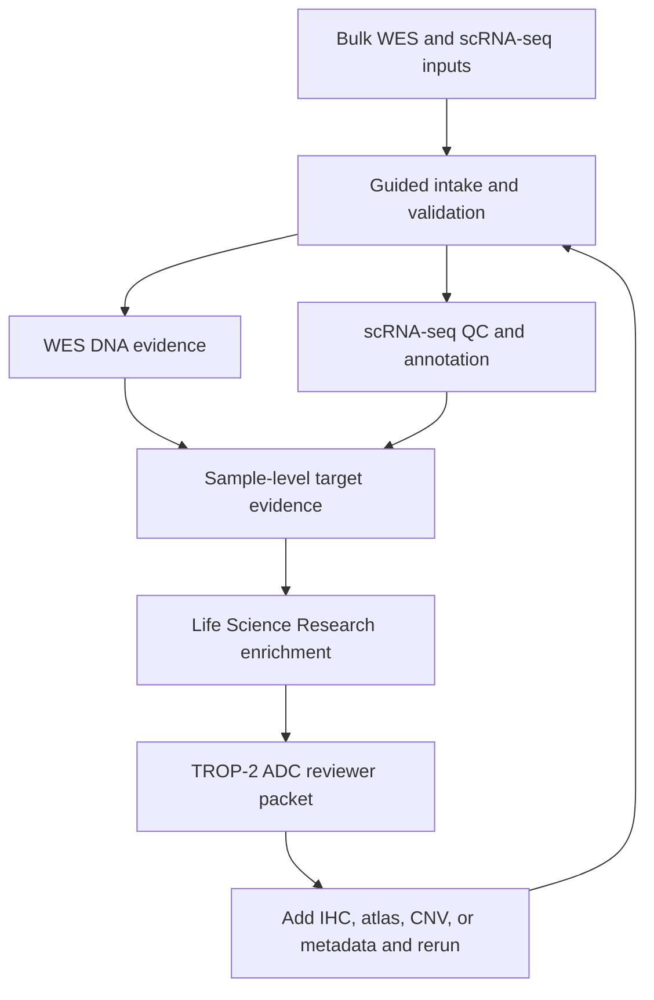

# GPT-Rosalind TROP-2 ADC Target Workflow

This page describes how we could use GPT-Rosalind, Codex, the Life Sciences NGS Analysis plugin, and the Life Science Research plugin to assess whether TROP-2 is a good antibody-drug conjugate (ADC) target in a sample or cohort using bulk WES plus single-cell RNA-seq.

The target is TROP-2, encoded by `TACSTD2`. The objective is target-assessment support, not a treatment recommendation. A final ADC decision would require clinical context, pathology review, protein-level confirmation such as IHC or flow cytometry, and oncologist signoff.

## Operating Model

GPT-Rosalind should coordinate three evidence layers:

| Layer | Role | Main responsibility |
| --- | --- | --- |
| Bulk WES | Assess genomic support and liabilities. | Validate tumor-normal WES, call somatic/germline variants, estimate copy-number signals, check `TACSTD2` locus integrity, and summarize tumor context. |
| scRNA-seq | Assess cellular expression and heterogeneity. | QC and annotate cells, identify malignant epithelial populations, quantify `TACSTD2` expression across tumor and non-tumor compartments, and expose heterogeneity. |
| Research synthesis | Add sourced external context. | Normalize `TACSTD2`/TROP-2, retrieve ADC, disease, pathway, normal-tissue, clinical, and literature context, and reconcile sample evidence with public evidence. |

Use WES to answer "is there genomic support or a genomic blocker?" Use scRNA-seq to answer "which cells express the target, and how heterogeneous is expression?" Use the research layer to answer "does public evidence support TROP-2 ADC relevance in this disease context?"

## Starter Prompt

Use this prompt when bulk WES and scRNA-seq files are staged:

```text
Use GPT-Rosalind with the NGS Analysis and Life Science Research plugins.

Assess whether TROP-2, encoded by TACSTD2, is a plausible ADC target for the provided sample or cohort using bulk WES plus scRNA-seq. Validate the WES tumor-normal inputs, reference build, target BED, sample pairing, and available CNV outputs. Validate the scRNA-seq matrix bundle, metadata, and cell annotations or run post-count QC and annotation if needed.

For WES, report tumor purity, callability at TACSTD2 and payload-relevant genes, somatic/germline variants affecting TACSTD2, copy-number status near the TACSTD2 locus, and any genomic caveats that would weaken target confidence.

For scRNA-seq, identify malignant epithelial cells, quantify TACSTD2 expression by cluster, sample, and compartment, report the fraction of malignant cells expressing TACSTD2, compare malignant expression to immune, stromal, endothelial, and normal-like epithelial cells, and flag target heterogeneity.

Then use Life Science Research to summarize sourced external evidence for TROP-2 ADCs, normal-tissue expression, tumor-type evidence, clinical-trial or approval context, and resistance or biomarker caveats.

Return:
- run_manifest.json
- wes_validation_summary.csv
- wes_tacstd2_locus_summary.csv
- scrna_qc_summary.csv
- scrna_tacstd2_expression_by_cluster.csv
- malignant_cell_target_fraction.csv
- trop2_adc_evidence_context.md
- trop2_target_assessment.csv
- reviewer_packet.md with target-confidence class, caveats, and next actions
```

## Workflow Stages



## Intake

GPT-Rosalind should first inspect available files and metadata before asking questions. It should resolve:

- disease, histology, sample IDs, collection site, and treatment context;
- WES tumor-normal pairing, reference build, target BED, BAM/FASTQ/VCF availability, and CNV files;
- scRNA-seq input type: 10x matrix bundle, `.h5ad`, matrix/barcodes/features, or count matrices;
- whether scRNA metadata identifies malignant, epithelial, immune, stromal, endothelial, and normal-like compartments;
- whether a matched normal tissue, adjacent normal, or public normal atlas will be used for off-tumor expression context;
- whether protein-level data such as TROP-2 IHC, flow cytometry, CITE-seq, or spatial data are available;
- whether cloud upload is allowed for human data.

If WES and scRNA samples are not matched from the same patient or lesion, the packet must report that as a major caveat.

## Bulk WES Evidence

WES is useful for genomic target assessment, but it cannot prove cell-surface protein expression. GPT-Rosalind should use WES to assess:

| Question | WES evidence | Interpretation |
| --- | --- | --- |
| Is the `TACSTD2` locus callable? | Coverage and callability across captured exons and nearby copy-number bins. | Low coverage or missing capture blocks target-genomic conclusions. |
| Is the target disrupted? | Somatic or germline coding variants, splice variants, frameshifts, or focal losses affecting `TACSTD2`. | Loss-of-function or antigen-altering events weaken target confidence. |
| Is there copy-number support? | Copy gain, amplification, neutral state, or deletion near `TACSTD2`. | Gain can support expression plausibility; deletion weakens it. WES CNV needs cautious interpretation. |
| Is the tumor context compatible with TROP-2 ADC evidence? | Histology, driver context, prior therapies, tumor purity, and broad mutation/CNV context. | Supports external evidence matching but does not establish target expression. |
| Are payload-relevant caveats present? | Exploratory review of DNA repair, TOP1 pathway, SLFN11, UGT1A1, and other context only when validated for the intended ADC and assay. | Treat as hypothesis-generating unless a locked biomarker policy exists. |

Recommended NGS Analysis routes:

| Need | Preferred skill or workflow | Output |
| --- | --- | --- |
| DNA route selection | `ngs-analysis-router`, `ngs-dna-variant-calling` | Selected WES somatic or focused BAM/CRAM path. |
| Tumor-normal calls | `ngs-dna-somatic-variants` or nf-core/sarek | Somatic VCF, pair review, contamination/filtering status. |
| Germline context | `ngs-dna-germline-variants` when normal is available | Germline VCF/gVCF and known-sites/resource status. |
| Focused locus QC | compact BAM/CRAM QC runner or existing `diana_omics` helpers | Coverage, callability, and variants at `TACSTD2`. |

WES output should include:

```text
wes_validation_summary.csv
wes_tacstd2_locus_summary.csv
wes_somatic_variant_summary.csv
wes_copy_number_summary.csv
wes_payload_context_hypotheses.csv
```

## scRNA-seq Evidence

scRNA-seq is the primary omics layer for target presence and heterogeneity in this workflow. GPT-Rosalind should use the NGS Analysis `scrna-seq-qc` pattern to produce threshold-justified QC, annotations, UMAPs, and review artifacts.

Core questions:

| Question | scRNA evidence | Interpretation |
| --- | --- | --- |
| Which cells are malignant? | Copy-number inference from expression, epithelial markers, tumor markers, metadata, or supplied annotations. | Target assessment should focus on malignant cells, not only all epithelial cells. |
| What fraction of malignant cells express `TACSTD2`? | Percent positive by threshold, mean expression, median expression, and distribution by cluster. | High, broad expression supports ADC plausibility; low or subclonal expression weakens it. |
| Is expression heterogeneous? | Cluster-level and sample-level expression distributions. | Strong heterogeneity increases antigen-negative escape risk. |
| Is expression present in non-tumor cells? | Expression in immune, stromal, endothelial, and normal-like epithelial compartments. | Off-tumor expression increases safety concern, especially in epithelial tissues. |
| Is the scRNA result technically reliable? | Library size, mitochondrial percentage, dropout rate, doublet status, ambient RNA, and batch effects. | Poor QC or ambient contamination can create false target positives or negatives. |

Recommended scRNA outputs:

```text
scrna_qc_summary.csv
scrna_annotation_summary.csv
scrna_tacstd2_expression_by_cluster.csv
scrna_tacstd2_expression_by_sample.csv
malignant_cell_target_fraction.csv
off_tumor_compartment_expression.csv
target_heterogeneity_plots/
visualizations/index.html
```

Protein-level confirmation remains strongly preferred. If scRNA suggests high `TACSTD2`, the next action should usually be TROP-2 IHC, flow cytometry, CITE-seq, or spatial validation.

## Research Enrichment

After sample evidence exists, use the Life Science Research plugin to add sourced context.

| Question | Useful research skill family | Output |
| --- | --- | --- |
| What is TROP-2 / `TACSTD2`? | UniProt, Ensembl, Reactome, STRING, GO | Target identity, protein function, pathway context. |
| Is TROP-2 expressed in this cancer type? | Human Protein Atlas, cBioPortal, literature, public expression datasets | Tumor-type expression context and caveats. |
| What is normal-tissue expression? | Human Protein Atlas, GTEx, cellxgene, Bgee, literature | On-target/off-tumor risk context. |
| Which TROP-2 ADCs are clinically relevant? | ClinicalTrials.gov, literature, regulatory sources, drug databases | ADC landscape and disease-specific evidence. |
| Are there known resistance or biomarker caveats? | Literature, clinical evidence, pathway context | Hypotheses around antigen heterogeneity, payload sensitivity, sequencing line, and resistance. |

Research enrichment should stay separate from sample evidence. Public TROP-2 ADC success in a tumor type does not override low or heterogeneous `TACSTD2` expression in the sample.

## Target Assessment Gates

The packet should classify each evidence lane before producing an overall target-confidence class.

| Gate | Strong support | Weak or no-call condition |
| --- | --- | --- |
| WES sample validity | Tumor-normal WES passes pairing, reference, contamination, and callability checks. | Missing normal, reference mismatch, poor coverage, or failed QC. |
| `TACSTD2` locus integrity | Callable locus with no disruptive target-loss event; copy gain or neutral state acceptable. | Low callability, focal deletion, or disruptive coding/splice event. |
| Malignant-cell expression | High fraction of malignant cells express `TACSTD2` with robust expression across clusters. | Low expression, dropout-dominated signal, or expression limited to a small subclone. |
| Tumor specificity | Malignant expression exceeds non-malignant compartments in the dataset and is contextualized against normal tissue. | High expression in normal-like epithelial or other non-tumor cells without safety context. |
| Heterogeneity | Expression is broad across malignant compartments and samples. | Strong antigen-negative subclones or lesion-to-lesion discordance. |
| External evidence | TROP-2 ADC evidence exists for disease, lineage, or related context. | No disease-relevant evidence or conflicting evidence dominates. |
| Orthogonal confirmation | IHC, CITE-seq, flow, or spatial data support surface protein expression. | No protein-level confirmation; classification should remain provisional. |

## Target Confidence Classes

Use these terms consistently:

| Class | Meaning |
| --- | --- |
| `strong_adc_target_candidate` | WES QC passes, `TACSTD2` locus is intact or gained, malignant scRNA expression is high and broad, off-tumor expression is not excessive in the reviewed context, external ADC evidence is relevant, and protein confirmation exists or is planned. |
| `plausible_adc_target_candidate` | Most evidence supports TROP-2, but one important item is missing, such as protein confirmation, matched normal context, or fully resolved malignant-cell annotation. |
| `mixed_or_heterogeneous_candidate` | TROP-2 is present but strongly heterogeneous, lesion-specific, or accompanied by concerning non-tumor expression. |
| `low_evidence_candidate` | WES and scRNA evidence are incomplete or weak; target suitability cannot be concluded. |
| `not_supported_candidate` | `TACSTD2` is not expressed in malignant cells, appears genomically lost/disrupted, or external/sample evidence argues against target suitability. |
| `blocked` | Required input files, metadata, tools, or approvals are missing. |

Do not classify a sample as a strong ADC target from WES alone. WES can support locus integrity and tumor context, but target expression and surface protein evidence require RNA/protein layers.

## Reviewer Packet

The final output should be a target-assessment packet, not a therapy recommendation.

Required sections:

1. Input inventory and sample matching.
2. WES validation and `TACSTD2` locus evidence.
3. Somatic/germline and copy-number context.
4. scRNA-seq QC, annotation, and malignant-cell definition.
5. `TACSTD2` expression by malignant cluster, sample, and compartment.
6. Off-tumor and normal-tissue expression context.
7. TROP-2 ADC clinical and literature context.
8. Target-confidence class and evidence table.
9. Missing evidence and no-call reasons.
10. Recommended next actions.

Recommended output layout:

```text
results/rosalind_trop2_adc/<sample_or_cohort>/<run_id>/
```

Recommended files:

```text
run_manifest.json
input_evidence_index.json
wes_validation_summary.csv
wes_tacstd2_locus_summary.csv
scrna_qc_summary.csv
scrna_tacstd2_expression_by_cluster.csv
malignant_cell_target_fraction.csv
off_tumor_compartment_expression.csv
trop2_adc_external_evidence.json
trop2_target_assessment.csv
reviewer_packet.md
next_actions.md
```

## Same-Thread Iteration

GPT-Rosalind is most useful after the first packet, when the user can fix gaps in the same thread:

- provide matched WES normal or corrected target BED;
- add copy-number segmentation or purity estimates;
- supply matched scRNA metadata or malignant-cell annotations;
- add a reference atlas for normal epithelial comparisons;
- rerun scRNA QC after threshold changes;
- add TROP-2 IHC, CITE-seq, flow cytometry, or spatial validation;
- ask for a sourced summary of a specific TROP-2 ADC, disease context, or resistance mechanism.

Each rerun should preserve previous artifacts and write a new manifest.

## Boundary

This workflow can help decide whether TROP-2 is a plausible ADC target to investigate. It cannot determine patient treatment, predict response, or replace clinical pathology. The strongest evidence package would combine:

- matched tumor-normal WES;
- high-quality scRNA-seq with reliable malignant-cell annotation;
- protein-level TROP-2 confirmation;
- normal-tissue/off-tumor review;
- ADC-specific clinical context;
- reviewer signoff.

## Source Pattern

This design follows the OpenAI life-sciences workflow pattern documented in:

- [Introducing new capabilities to GPT-Rosalind](https://openai.com/index/introducing-new-capabilities-to-gpt-rosalind/)
- [Codex Life Sciences collection](https://developers.openai.com/codex/use-cases/collections/life-sciences)
- [scRNA-seq post-count QC use case](https://developers.openai.com/codex/use-cases/scrna-seq-post-count-qc)
- [Life Science Research plugin](https://github.com/openai/plugins/tree/main/plugins/life-science-research)
- [Life Sciences NGS Analysis plugin](https://github.com/openai/plugins/tree/main/plugins/ngs-analysis)

Relevant TROP-2 / ADC context should be refreshed during each run from current sources such as:

- [FDA approval notice for datopotamab deruxtecan in HR-positive, HER2-negative breast cancer](https://www.fda.gov/drugs/resources-information-approved-drugs/fda-approves-datopotamab-deruxtecan-dlnk-unresectable-or-metastatic-hr-positive-her2-negative-breast)
- [FDA accelerated approval notice for datopotamab deruxtecan in EGFR-mutated NSCLC](https://www.fda.gov/drugs/resources-information-approved-drugs/fda-grants-accelerated-approval-datopotamab-deruxtecan-dlnk-egfr-mutated-non-small-cell-lung-cancer)
- [TRODELVY HCP indication page](https://www.trodelvyhcp.com/)
- [Human Protein Atlas TACSTD2 cancer page](https://www.proteinatlas.org/ENSG00000184292-TACSTD2/cancer)

