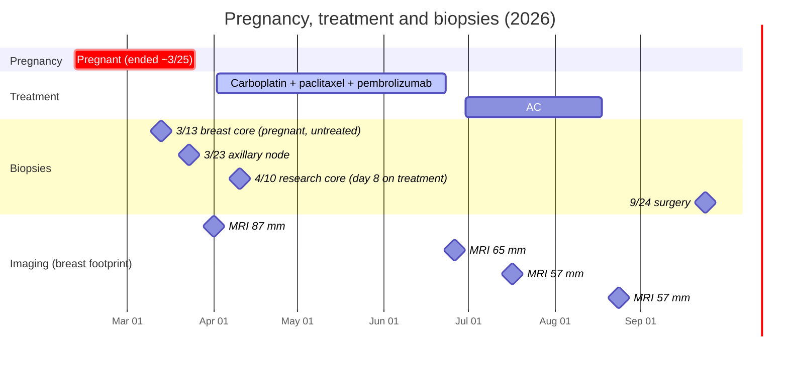

# Connecting the omics with the clinical record

Diana multi-omic review · step 17 (with step 18 corrections) · 4 Oct 2026

This is the markdown version of the visual summary at https://claude.ai/artifact/G4bVeHrbtmTgb2E3wiKzt8 (shared by
link). The full report is [connect_the_dots.md](connect_the_dots.md).

We read the family's knowledge base (diagnostic reports, imaging, lab and genomic tests, meeting notes and the research
library) against everything the sequencing work has verified. Five connections change how the data should be read.

> Research hypotheses for discussion with the oncology team, not treatment recommendations. RNA is not protein: every
> target idea needs IHC or another protein assay.

| | Finding | In one line |
|---|---|---|
| Context | **A pregnancy-associated tumor** | Diana was ~9 weeks pregnant at diagnosis. The pregnancy may contribute to the luminal-progenitor state, the IgA infiltrate and part of the MRI response, though ELF5/EHF also sit on a DNA gain. |
| Timing | **Two biopsies, two states** | WGS and Altera are from 3/13 (pregnant, untreated). Exome/RNA, proteomics, the 50% TIL score and probably the single-nucleus sample are from 4/10, day 8 on treatment. |
| Biology | **A specific DNA-repair programme** | POLQ, ATR, HORMAD1 and RAD51 are up versus other TNBC while proliferation genes are not. p21 is nearly absent, matching the TP53 splice mutation. |
| Genome | **One composite amplicon** | Junctions join 11q13, 22q12 and the CD44 region into a single structure. SHANK2, CTTN and CD44 are expressed; CCND1 is not. |
| Immunity | **Hot stroma, quiet tumor cells** | High TILs, but tumor cells show low antigen processing and only one copy of B2M left. One more hit could hide them from T cells. |

---

## The timeline that frames every dataset

Each result describes the tumor at a particular moment. The pregnancy ended about a week before chemo-immunotherapy
started. The research biopsy that fed most tumor-cell and immune assays was taken eight days into treatment, the
morning after the second carboplatin and paclitaxel dose.

| Date | Specimen | Pregnancy / treatment state | Samples and data from it |
|---|---|---|---|
| **3/13** | Sutter breast core, block A2 (`SUS-26-01600`) | ~8 weeks pregnant, untreated | Altera DNA/RNA · Signatera panel · NeXT Personal panel · **WGS** |
| **3/23** | Stanford axillary node core (`SP-26-022231`) | Pregnant, untreated | HistoWiz TIL score (10%) |
| **4/10** | Stanford breast research core (`SP-26-027487`), FFPE block A1 | 16 days after the pregnancy ended; day 8 of treatment, the morning after dose 2 | Personalis **exome + RNA** · **Proteomics** · HistoWiz TIL score (50%) · Ki67 61-70% |
| **4/10** | Same biopsy, flash-frozen breast vials | Same as above | **Single-nucleus RNA (KH022)**, likely; vial and date not yet confirmed by Signios |
| **9/24** | Surgery | After treatment | Pathology not yet available |

Blood (not tumor): 4/1 Altera normal and Signatera baseline · 4/3 Guardant360 · 4/18-7/20 Signatera and NeXT Personal ctDNA series.

How the assignments were made:
- They trace accession and block numbers across vendor reports.
- The NeXT Personal tissue accession PSN49561A2 matches the WGS sample DRF-PSN49561.
- The proteomics specimen ID SP-26-027487-BR-VL3-A1 is the 4/10 Stanford core, even though its header says 3/13.
- KH022 = 4/10 is an inference (Kernis customer ID, flash-frozen 4/10 vials, breast composition) awaiting the manifest.

---

## 1. A pregnancy-shaped lineage, partly written in DNA

**What we see**
- The tumor cells' own defining genes (low background share, at least 4x above non-malignant cells) are the alveolar
  programme that pregnancy hormones expand.
- The basal keratins that most TNBC express are nearly absent.

**Two later checks refine this**
- **Partly genetic:** the luminal-progenitor master regulators ELF5 and EHF sit on a 9-copy DNA segment next to the CD44
  amplicon.
- **Casein is made by the tumor cells:** the exported mRNA dominates the background RNA, but pre-mRNA is ~3.3x higher
  in tumor nuclei (step 19).

Diana's tumor nuclei vs tumor cells from 8 public TNBC (GSE161529), after a nuclei-vs-whole-cell correction:

| Group | Gene | Fold vs public TNBC tumor cells | Note |
|---|---|---|---|
| Milk / pregnancy | CSN3 (κ-casein) | — | Tumor-transcribed (intronic); mature mRNA dominated by background |
| | XDH | ~12x | |
| | LALBA (α-lactalbumin) | not detected | Target of the only lineage vaccine in the KB |
| Alveolar progenitor programme | ERBB4 | ~30x (mature mRNA) | 99% unspliced; HER4 protein not detected; normal-lineage gene |
| | ESRRG | ~60x | |
| | MECOM | ~50x | On a chr3q gain |
| | EHF | ~20x | On a 9-copy segment |
| | ELF5 | ~8x | On a 9-copy segment |
| | PRLR | ~7x (mature mRNA) | Normal hormone-sensing-lineage gene; not tumor-selective |
| Basal keratins | KRT5 | ~1/30 | |
| | KRT14 | ~1/80 | |
| | KRT17 | ~1/85 | |

**Two readings, both possible**
- **Cell of origin:** BRCA1-null breast cancers arise from luminal progenitors, and the ELF5/EHF amplification points
  toward a genetic contribution.
- **Hormonal state:** part of the programme could be pregnancy-induced and fade now that the hormones are gone.
- The IgA plasma-cell infiltrate may be
  normal post-pregnancy breast biology rather than an anti-tumor response.

**Test:** compare ELF5, PRLR, ERBB4 and IgA versus IgG plasma cells in the 9/24 surgical tissue (six months after the
pregnancy) with the 4/10 core.

---

## 2. The DNA-repair signal is specific, not proliferation

One reader suspected that POLQ and ATR were high only because the sample was taken a day after paclitaxel, which stalls
cells in division. The data say otherwise:
- **Proliferation genes** are typical or below other TNBC.
- **The backup DNA-repair machinery** is up.
- **p21 (CDKN1A),** the main p53 target, is about 20x lower than in other TNBC tumor cells. That is a functional readout
  of the TP53 splice mutation.

| Group | Gene | Fold vs public TNBC tumor cells | Public tumors exceeded >2x |
|---|---|---|---|
| DNA repair / replication stress | HORMAD1 | ~27x | 8/8 |
| | POLQ | ~10x | 8/8 |
| | ATR | ~5x | 8/8 |
| | BLM | ~3.4x | 6/8 |
| | RAD51 | ~3.1x | 8/8 |
| | BRCA2 | ~3.0x | 5/8 |
| | FANCD2 | ~2.8x | 6/8 |
| Proliferation / mitosis | MKI67 | ~0.9x | 2/8 |
| | MCM2 | ~0.9x | 2/8 |
| | TOP2A | ~0.6x | 1/8 |
| | CDK1 | ~0.55x | 1/8 |
| | PCNA | ~0.55x | 1/8 |
| | CCNB1 | ~0.5x | 2/8 |
| p53 target | CDKN1A (p21) | ~1/20 | 1/8 |

**What it means**
- This fits an HR-deficient tumor leaning on POLQ-mediated end joining (60% of its larger deletions carry
  microhomology) and the ATR replication-stress checkpoint.
- Carboplatin given the day before could still have induced some repair transcription. HORMAD1 is usually switched on
  epigenetically, which argues against that for HORMAD1.

**Test:** POLQ, ATR and HORMAD1 in the untreated 3/13 RNA and in residual tumor; RAD51 foci on surgical tissue.

---

## 3. Three amplicons are one structure

The WGS shows four junctions joining the 11q13 amplicon to chromosome 22q12, each landing on a copy-number boundary. A
fifth joins the CD44 amplicon to the edge of the 11q13 gain. The clinical Altera report saw the 11q13 genes (DHCR7,
FADD, NADSYN1, ORAOV1) but not the rest.

| Amplicon | Copies | Expressed genes |
|---|---|---|
| chr11p13 (CD44) | ~12 | CD44, LDLRAD3; ELF5/EHF on the adjacent 9-copy segment |
| chr11q13 | ~9 | SHANK2 (~2,900 CPM), PPFIA1, CTTN, NADSYN1; CCND1 amplified but **not** over-expressed |
| chr22q12 | 8-10 | EWSR1, SPECC1L, DEPDC5 |

| Junction (GRCh38) | Joins |
|---|---|
| chr11:69,117,506 ↔ chr22:37,738,031 | 11q13 ↔ 22q |
| chr11:69,282,452 ↔ chr22:29,052,945 | 11q13 ↔ 22q12 amplicon start |
| chr11:69,540,177 ↔ chr22:25,163,317 | 11q13 amplicon left edge ↔ 22q |
| chr11:71,796,556 ↔ chr22:31,496,028 | 11q13 amplicon right edge ↔ 22q12 amplicon |
| chr11:36,269,951 ↔ chr11:75,132,133 | CD44 amplicon edge ↔ 11q13 gain edge |

**What it means**
- If this is a breakage-fusion-bridge or extrachromosomal unit, CD44 copy number may vary from cell to cell and shift
  under treatment.
- CD44 is the one surface target that is amplified, tumor-enriched and high against other TNBC, and it does not depend
  on HLA.
- p16 protein is present and CCND1 is not over-expressed; both argue against a CDK4/6 rationale.

**Test:** AmpliconArchitect on the WGS; per-nucleus amplicon heterogeneity; CD44v6 isoform reads.

---

## 4. Response: early, partly physiological, then a plateau

**What we see**
- Most of the MRI change happened during the carboplatin phase, consistent with HRD platinum sensitivity.
- The healthy left breast's enhancement fell almost as much, so part of the April signal was post-pregnancy background.
- ctDNA was counted in single molecules and cleared by week 12.

| MRI date | Breast footprint (mm) | Clipped node (mm) | Right-breast early enhancement | Left-breast (no cancer) enhancement |
|---|---|---|---|---|
| 4/1 | 87 | 21 x 11 | 175% | 125% |
| 6/26 | 65 | 18 x 9 | 37% | 40% |
| 7/17 | 57 | 15 x 8 | 34% | 36% |
| 8/24 | 57 | 13 x 7 | 36% | 24% |

| ctDNA draw | NeXT Personal (PPM) | Signatera (MTM/mL) |
|---|---|---|
| 4/1 | | 0.87 |
| 4/18 - 4/20 | 304 | 0.48 |
| 5/28 | | 0.17 (~2 molecules, at the calling floor) |
| 6/9 | 1 | |
| 7/1 - 7/6 | not detected | 0.00 |
| 7/20 | not detected | 0.00 |

Both ctDNA panels were designed from the 3/13 block.

**Low tumor density.** Low FDG uptake (SUVmax 4.1), low ctDNA and 0.35 purity together suggest a sparse, diffusely
infiltrating tumor whose imaging extent overstates its cell mass.

**Test:** a right-minus-left normalized enhancement curve, and region-by-region radiology-pathology mapping of the
residual 57 mm at surgery.

---

## 5. Hot stroma, quiet tumor cells

**The stroma**
- The breast core had 50% stromal TILs, rich in IgA plasma cells and macrophages.
- Fibroblasts make CXCL12, a chemokine that retains plasma cells and can keep CD8 cells away from tumor.

**The tumor cells**
- Antigen-processing genes run at 0.3 to 0.6x of normal breast epithelium.
- PD-L1 protein was not detected.
- B2M is down to one copy.
- The 6/10 granzyme-B research PET showed no focal uptake.
- Compared with her own cells (step 18), tumor cells have the lowest antigen-presentation score in the sample and show
  no interferon-γ response, while neighbouring normal myoepithelial cells do.

**From the research library**
- It holds a TNBC vaccine patient who relapsed by losing B2M despite strong T-cell responses.
- A speculative link: ELF5 drives degradation of the IFN-γ receptor. That would tie the luminal-progenitor state to the
  low interferon-driven antigen processing.

**For the vaccine**
- Serova's HLA typing is unaccredited.
- It conflicted with an earlier typing at the A and B genes, which present 24 of the 27 vaccine windows.
- No clinical HLA typing exists.

**Tests:** accredited HLA typing (a free first pass from the normal WGS), B2M and HLA-I IHC on residual tumor, and the
remaining B2M allele added to ctDNA monitoring.

---

## Hypotheses at a glance

| Hypothesis | Key evidence | Against | Confidence | Cheapest test |
|---|---|---|---|---|
| The tumor cell state carries a pregnancy imprint | ELF5/PRLR/ERBB4/XDH programme; pregnancy confirmed | ELF5/EHF amplified (9 copies); BRCA1-null tumors are luminal-progenitor-derived anyway | Medium | ELF5/PRLR on 9/24 surgery tissue |
| IgA infiltrate is partly gestational physiology | IgA ≫ IgG; CCL28 expressed; post-pregnancy timing | High TILs + HRD predict response on their own | Medium | IgA/IgG and CCL28 IHC, 3/13 vs surgery |
| Immune data reflect day-8 treatment, not baseline | Accessions tie TIL, proteomics, exome/RNA to 4/10 | KH022 date still inferred | High | Score the 3/13 slide; KH022 manifest |
| POLQ/ATR/HORMAD1 programme is intrinsic | Proliferation genes not raised; p21 absent | Carboplatin the day before | Medium | Altera 3/13 RNA |
| BRCA1 is near-null; escape would be RING-less or POLQ reversion | All mutant transcripts stop by codon ~28; 97% mutant pre-mRNA | No protein data | High | RAD51 foci; BRCA1 resequencing in residual |
| 11q13, 22q12 and CD44 form one amplicon | 5 junctions on CN boundaries | Low read support on some junctions | Medium | AmpliconArchitect (local) |
| Tumor is one hit from HLA-I loss | B2M 1:0; low antigen processing; no GZMB PET signal | No clonal HLA loss; processing is inducible | Medium | B2M/HLA-I IHC; B2M on ctDNA panel |
| B7-H4 ADC + PARP fits better than TROP-2 + PARP | HRD verified; TROP-2 typical; but B7-H4 is not above other TNBC on mature mRNA (step 19) | Advanced disease only; SLFN11-low; B7-H4 equally high in her normal duct cells | Low–medium | B7-H4 IHC |
| Imaging extent overstates tumor mass | NME, SUV 4.1, ctDNA 0.3%, purity 0.35 | Indirect | Low–medium | Rad-path mapping at surgery |

## Corrections to earlier records

- **Casein:** tumor-transcribed; the exported mRNA dominates the background (step 19).
- **B7-H4, CARD18, ERBB4:** not outliers vs other TNBC on mature mRNA, or artifacts (step 19 QC).
- **HER2:** Stanford's 4/10 report reads "0+ with membrane staining", the HER2-ultralow category, not plain 0.
- **TP53 c.559+2T>G:** already listed in Altera's trials table and detected by Guardant on 4/3. Our pipeline confirmed
  it rather than discovered it.
- **Proteomics:** from the 4/10 on-treatment core, not the 3/13 pre-treatment specimen.
- **"HRD 62":** untraceable. Replace with HRD-high across fits (67–99), research grade.
- **SLFN11 and vimentin:** the high bulk signals came from stroma. Tumor cells are SLFN11-low.
- **ADC queue led by HER3, MET and EGFR:** a capture-library artifact. Step 19 Tier A candidates are PSMA, ENPP3, SLC28A3, SLC6A14, HORMAD1; plus CD44,
  ENPP3, PRLR and HORMAD1, pending IHC.
- **Altera fusions:** 5 of 11 reproduce in the WGS. The PTPN2 break is probably on one copy only. IGKV2D-29::IGKJ4 is a
  normal antibody rearrangement.

## What would settle the most, for the least

1. **One panel on the 9/24 surgical tissue:**
   - RCB per region with imaging correlation.
   - RAD51 foci.
   - B2M/HLA-I.
   - B7-H4, CD44, PSMA (tumor vs vessel), membrane TROP-2.
   - ELF5/PRLR and IgA/IgG.
   - SLFN11 in tumor vs stroma.
   - BRCA1 resequencing for reversions.
2. **Free, from data we already have:**
   - HLA typing from the normal WGS.
   - Amplicon reconstruction and per-nucleus amplicon heterogeneity.
   - The 9 subclonal variants genotyped in the single-nucleus data to confirm its specimen.
   - Right-minus-left MRI kinetics.
   - Done: the normal-breast reference shows PRLR, ERBB4 and B7-H4 are normal-lineage genes, and the Tier A targets are tumor-selective.
3. **Records to request:**
   - Altera 3/13 RNA raw data.
   - KH022 sample manifest.
   - Corrected proteomics requisition.
   - Altera's final PD-L1 report.
   - Guardant variant detail.
   - A TIL score on the 3/13 breast slide.
4. **For the vaccine:**
   - Accredited HLA typing before manufacture.
   - Drop the unsupported SHANK2 window.
   - Ask about the truncal TP53 and BRCA1 splice junctions and HORMAD1.
   - Monitor B2M.

---

**Method.** Four readers each covered one part of the knowledge base, working from a brief of the verified omics
findings. The load-bearing claims were then checked against primary files and the sequencing data:
- the pregnancy record;
- the Stanford HER2 text;
- the Manta junction positions;
- the BRCA1 splice frame;
- the gene tables, recomputed from the single-nucleus comparison.
